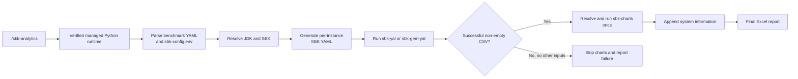
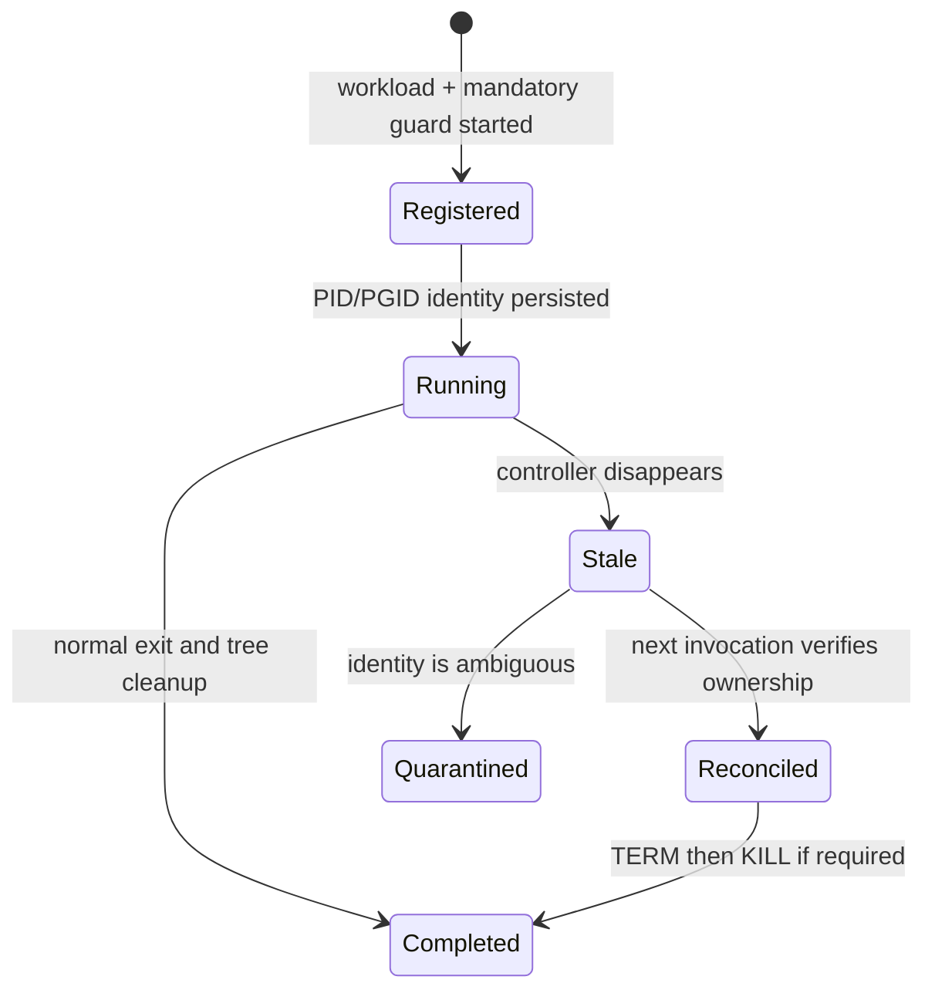

# sbk-analytics

Performance benchmarking with [SBK](https://github.com/kmgowda/SBK) and analytics
with [sbk-charts](https://github.com/kmgowda/sbk-charts), combined into a single
orchestrator.

`sbk-analytics` reads two inputs:

1. A **SBK configuration file** that pins the release tags of SBK and
   sbk-charts to use, along with folder paths and SSL settings. The corresponding
   release assets are downloaded once and cached under the specified folders
   (default: ./.sbk for SBK/sbk-charts, ./.jdk for JDK).
2. A **YML configuration file** describing the benchmark run.

From those it:

- Generates one YAML config per storage class for `sbk-yal` (or `sbk-gem-yal`
  if the `sbk.nodes` parameter is present).
- Runs an SBK instance per class, in serial or parallel mode, each emitting a
  CSV via `CSVLogger`.
- Invokes `sbk-charts` **once** at the end with all successful CSVs to produce
  a single Excel file with comparison charts (and optional AI-generated
  analytics).
- Appends a `system` sheet to that xlsx with CPU, memory, and disk details of
  the host.

If **all** SBK instances fail, `sbk-charts` is **not** executed.

## Local packages and dependency diagnostics

Use already-built packages without any SBK or sbk-charts download:

```bash
sbk-analytics config init --output sbk-config.local.env
# Edit the two local folder paths, then validate everything:
sbk-analytics deps doctor -p sbk-config.local.env
sbk-analytics -p sbk-config.local.env -c examples/file-rocksdb-write-60s.yml
```

For one-off runs, CLI paths are more convenient:

```bash
sbk-analytics --sbk-local /root/projects/SBK \
  --sbk-charts-local /root/projects/sbk-charts \
  -c examples/file-rocksdb-write-60s.yml
```

The resolver prints `LOCAL`, `MANAGED_CACHE`, or `DOWNLOADED` plus
the exact executable selected. An explicitly selected invalid local folder is
an error and never silently falls back to the network. `sbk-charts` is resolved
only after a benchmark produces usable CSV input; use `deps doctor` to check it
before a long run.

## Quick Start

### Self-bootstrapping application

The repository includes an extensionless `sbk-analytics` application, modeled
after the sbk-dashboard launcher, that delegates to the Linux/macOS bootstrap
launcher and passes every argument unchanged. Native Windows is not supported.

Linux/macOS:

```bash
./sbk-analytics --version
./sbk-analytics deps doctor
./sbk-analytics -c examples/file-rocksdb-write-60s.yml
```

The unified application dispatches to `sbk-analytics.sh`. The launcher does
not require system Python, venv, or Conda. On the first run it:

1. Detect the operating system and architecture.
2. Download the pinned standalone `uv` executable and verify its checked-in
   SHA-256 digest, unless a verified copy is already cached.
3. Let uv install the exact Python version from `.python-version` into private
   application state.
4. Create a staged environment and install `uv.lock` with `--locked` and
   `--no-editable`, forcing the local application package to be rebuilt.
5. Health-check the environment, write metadata last, and publish it under its
   source/lock fingerprint.

Later runs validate and execute the saved environment without invoking uv or
the network. Concurrent launchers share per-environment locks; interrupted or
corrupt staging directories are never reused. Active `VIRTUAL_ENV` and
`CONDA_PREFIX` environments are deliberately not modified.

The fingerprint covers all runtime Python sources, packaged text/configuration,
root dependency and configuration files, examples, and every native launcher.
Changing any of those inputs creates a new environment and rebuilds the local
package, so a cached wheel cannot hide a source or version update.

The default runtime state is `${XDG_STATE_HOME:-~/.local/state}/sbk-analytics`
on Linux and `~/Library/Application Support/sbk-analytics` on macOS. Set
`SBK_ANALYTICS_ENV_HOME=/path/to/folder` to override it. Set
`SBK_ANALYTICS_BOOTSTRAP_OFFLINE=1` to prohibit downloads while repairing an
environment; a healthy saved environment is always reusable offline.

Exact Python, uv, platform checksums, runtime folder, and marker policy live in
`sbk-bootstrap.env`. `uv.lock` makes application dependencies reproducible.
Installer/status output goes to stderr, preserving the single-document
`--json` stdout contract. The application runs Python with safe-path mode and
clears `PYTHONPATH`/`PYTHONHOME`, so the mutable checkout cannot shadow the
installed package. The launcher still supplies the current checkout root to the
CLI so its editable `sbk-config.env` remains the default configuration.

Runtime policy and artifact metadata are centralized in
`analytics/policy.py`. This is the canonical source for dependency identities,
repository defaults, dependency source/layout vocabulary, executable and
environment names, managed-cache filenames, command-line contracts,
YAML/property aliases, diagnostic and lifecycle record schemas, SBK option
contracts, native probe commands, network/retry limits, display units, process
grace periods, native benchmark lifecycle, SSH behavior, configuration
defaults, and application exit codes.
Release version pins and operator choices remain in `sbk-config.env` so they can
be updated without changing Python code.

### Optional manual development environment (Conda)
```bash
conda env create -f environment.yml
conda activate sbk-analytics
pip install -e .
sbk-analytics -c examples/file-rocksdb-write-60s.yml
```

### Optional manual development environment (standard Python)
```bash
python3 -m venv .venv
. .venv/bin/activate
pip install -r requirements.txt
pip install -e .
sbk-analytics -c examples/file-rocksdb-write-60s.yml
```

## AI Agent Documentation

**For AI coding assistants**: See [analytics/AGENTS.md](analytics/AGENTS.md) for comprehensive documentation including:

- **Project Structure**: Detailed file-by-file breakdown
- **Architecture Overview**: Component interactions and data flow
- **Development Workflow**: How to make changes and test them
- **Key Design Decisions**: Important architectural choices
- **YAML Configuration Generation**: Complete guide for generating workload YAML files, including:
  - YAML schema and parameter reference
  - All storage driver classes and their parameters
  - Common workload patterns with examples
  - Best practices for YAML generation
  - Validation rules and troubleshooting
- **Troubleshooting Guide**: Common issues and solutions
- **Release Process**: How to build and distribute packages

### Quick Reference for AI Agents
- **Main package**: `analytics/` (Python package)
- **Entry point**: `analytics/cli.py:main()`
- **Configuration**: `sbk-config.env` (SBK versions, URLs, folders)
- **Examples**: `examples/` directory
- **Dependencies**: `requirements.txt` and `pyproject.toml`
- **Key modules**: `cli.py`, `releases.py`, `runner.py`, `processes.py`,
  `lifecycle.py`, `charts.py`, `yaml_gen.py`

## Additional Documentation

- **[analytics/ARCHITECTURE.md](analytics/ARCHITECTURE.md)** - High-level architecture and design
- **[analytics/CONTRIBUTING.md](analytics/CONTRIBUTING.md)** - Guidelines for contributors
- **[analytics/DEVELOPMENT.md](analytics/DEVELOPMENT.md)** - Quick development reference
- **[analytics/SUPPORT.md](analytics/SUPPORT.md)** - Help and troubleshooting guide
- **[analytics/CHANGELOG.md](analytics/CHANGELOG.md)** - Version history and changes
- **[analytics/AGENTS.md](analytics/AGENTS.md)** - Comprehensive AI agent documentation

## File Path Configuration

### Work Directory

The `workdir` parameter in your YAML configuration specifies where all output files are stored:
- Generated SBK YAML files (`yml/`)
- Per-instance CSV files (`csv/`)
- Parallel-mode logs (`logs/`)
- Final Excel report (when `sbk-charts.output` is a bare filename)

The workdir is automatically created by sbk-analytics. Default: `/tmp/sbk-analytics`

### Storage Driver File Paths

When configuring storage drivers that require file paths (like `file`, `rocksdb`, etc.), ensure the parent directories exist. Two approaches:

#### Option 1: Use the Work Directory (Recommended)
```yaml
workdir: /tmp/sbk-analytics

classes:
  - class: file
    file: /tmp/sbk-analytics/file-60s.dat  # Uses workdir
  - class: rocksdb
    rfile: /tmp/sbk-analytics/rocksdb-60s   # Uses workdir
```

#### Option 2: Create Custom Directories
```yaml
workdir: /tmp/sbk-analytics

classes:
  - class: file
    file: /custom/path/file-60s.dat  # Ensure /custom/path exists
  - class: rocksdb
    rfile: /custom/path/rocksdb-60s   # Ensure /custom/path exists
```

### Important Notes

- **Workdir is auto-created**: sbk-analytics automatically creates the workdir
- **Custom paths must exist**: If you use paths outside the workdir, create them manually
- **Relative paths**: File paths can be relative to the current directory
- **Absolute paths**: Recommended for reproducibility

## Prerequisites

`sbk-analytics` itself is a small Python package, but the tools it
orchestrates need a working runtime on the host:

| Tool | Required version | Notes |
| --- | --- | --- |
| Python    | not required | The launcher downloads and saves the pinned managed Python on first use. Python ≥3.9 is needed only for manual development installs. |
| SBK       | configured baseline or newer | The shipped release pin establishes the command and lifecycle contract; runtime code does not branch on an embedded version number. |
| JDK       | matching configured SBK build | Automatically resolved and cached by default. The SBK release archive ships `.class` files compiled with a specific JDK. |
| `curl` or `wget` | first Linux/macOS bootstrap only | Downloads the verified standalone runtime manager. |
| Internet access | first run / cache miss | Not needed after the runtime, JDK, SBK, and sbk-charts caches are populated. |

### Security compatibility defaults

TLS verification defaults to `false`, as shown in the bundled configuration.
This compatibility default is intended for isolated benchmark labs and private
artifact infrastructure; it trusts the configured network and must not be
treated as a secure Internet-facing default:

```ini
# sbk-config.env
ssl.verify=false
```

This disables SSL verification for:
- GitHub API calls (release metadata)
- SBK/JDK downloads via requests
- pip dependency downloads for sbk-charts and its legacy no-digest Git fallback

The stage-zero uv bootstrap is separate from this compatibility setting: it
always requires HTTPS and verifies the pinned archive SHA-256 before execution.

When TLS verification is disabled, dependency resolution also supplies the
centralized trusted-host list to pip. Remote system-information probes likewise
disable SSH host-key checking and use the operating system's null
known-hosts file. Use those SSH features only with dedicated, trusted benchmark
nodes unless the centralized SSH policy is hardened for your environment.

For stricter environments, set `ssl.verify=true`. A private trust root can be
selected with `ssl.ca.bundle=/path/to/company-ca.pem`. Invalid boolean values
are rejected instead of being treated as false.

## Build / install

### Option 1: Manual Conda development installation

Conda is recommended for macOS and Linux as it handles platform-specific dependencies (like PyTorch) better than pip.

#### Step-by-step Conda Installation

```bash
# 1. Clone the repository
git clone <this-repo-url> sbk-analytics
cd sbk-analytics

# 2. Create conda environment from environment.yml
conda env create -f environment.yml

# 3. Activate the environment
conda activate sbk-analytics

# 4. Install sbk-analytics in development mode
pip install -e .

# 5. Verify installation
sbk-analytics --version
```

#### What the Conda Installation Does

The `environment.yml` file includes:
- **Python 3.10** - Runtime environment
- **PyTorch** - Platform-appropriate version (handles Apple Silicon vs Intel automatically)
- **Core dependencies** - pyyaml, requests, etc.
- **Note**: sbk-charts is installed by sbk-analytics based on `sbk-config.env`, not by conda directly. This ensures version consistency with the configuration file.

#### Conda Environment Behavior

Manual Conda environments remain supported for development, but the native
application never modifies an active Conda environment. Managed sbk-charts is
always installed into its own versioned cache environment, preventing charts
dependencies from changing sbk-analytics itself.

#### Updating Conda Environment

```bash
# Update the environment if you modify environment.yml
conda env update -f environment.yml --prune

# Reinstall sbk-analytics if you make code changes
pip install -e .
```

### Option 2: Manual virtual-environment development installation

For users who prefer standard Python virtual environments.

#### Step-by-step Venv Installation

```bash
# 1. Clone the repository
git clone <this-repo-url> sbk-analytics
cd sbk-analytics

# 2. Create virtual environment
python3 -m venv .venv

# 3. Activate the environment
. .venv/bin/activate

# 4. Upgrade pip
python -m pip install --upgrade pip

# 5. Install dependencies
python -m pip install -r requirements.txt

# 6. Install sbk-analytics in development mode
python -m pip install -e .

# 7. Verify installation
sbk-analytics --version
```

#### Venv Environment Behavior

When using venv, sbk-analytics:
- Creates a separate venv for sbk-charts under `{downloads.folder}/sbk-charts/{version}/venv`
- Downloads and installs all dependencies including PyTorch via pip
- Respects SSL verification settings from `sbk-config.env`
- Caches installations for faster subsequent runs

### macOS Installation Notes

#### Platform-Specific Dependencies

macOS users may encounter issues with platform-specific dependencies like PyTorch,
especially on Apple Silicon (M1/M2/M3) vs Intel architectures. Common issues include:

- `torch~=2.9.1` not available for your specific macOS/Python combination
- Missing pre-built wheels for your architecture
- Binary compatibility issues

#### Recommended Solution: Use Conda

**For macOS users, the conda installation method (Option 1) is strongly recommended**
as it handles these platform-specific dependencies automatically through the pytorch channel.

#### Alternative Solutions for macOS

If you prefer not to use conda on macOS:

1. **Use an older sbk-charts version** with more compatible dependencies:
   ```ini
   # sbk-config.env
   sbk-charts.version=4.26.0.1
   ```

2. **Install PyTorch separately with conda, then use pip for sbk-charts**:
   ```bash
   conda install pytorch
   pip install git+https://github.com/kmgowda/sbk-charts.git@<version-from-sbk-config.env>
   ```

3. **Build PyTorch from source** (time-consuming but guaranteed to work):
   ```bash
   pip install torch==2.9.1 --no-binary :all:
   ```

### Verification

After installation, verify that everything works:

```bash
# Check version
sbk-analytics --version

# Run a simple benchmark (this will download dependencies on first run)
sbk-analytics -c examples/file-rocksdb-write-60s.yml
```

### Troubleshooting

#### Venv Installation Issues

If you encounter PyTorch installation issues with venv:
- Switch to conda installation (Option 1)
- Use an older sbk-charts version
- Install PyTorch separately before sbk-charts

#### Conda Installation Issues

If conda installation fails:
- Ensure you have conda or miniconda installed
- Update conda: `conda update conda`
- Try mamba instead of conda for faster dependency resolution
- Check that you have write permissions for the conda environment directory

#### SSL Certificate Issues

If you encounter SSL certificate errors:
- Set `ssl.verify=false` in your `sbk-config.env` file
- This is useful for corporate proxies with self-signed certificates
- See the SSL verification section below for details

### Environment Isolation

The self-contained launcher always uses its own fingerprinted application
environment. It does not select or modify an active Conda or venv environment.

#### Managed application runtime
- **Identity**: exact Python + uv version + platform + source/lock fingerprint
- **Behavior**: non-editable locked installation outside the checkout
- **Safety**: staged publication, health marker written last, and lock-based
  concurrent installation
- **Reuse**: no network or runtime-manager invocation after a healthy first run
- **Folder Structure** (default per-user runtime state):
  ```
  <runtime-state>/
  ├── tools/uv/<uv-version>/<platform>/
  ├── python/<python-version>/
  ├── app/<source-lock-fingerprint>/
  ├── cache/uv/
  └── locks/
  ```

#### Managed sbk-charts runtime
- **Behavior**: always creates an isolated venv under the dependency cache
- **Source**: the shipped configuration downloads a tag archive and verifies
  `sbk-charts.sha256`, avoiding a system Git requirement
- **Cache**: version and source digest are validated before reuse
- **Publication check**: the real `sbk-charts -h` command must start
  successfully before `.ok` is written; `deps doctor` repeats this check
- **Folder Structure** (default project-local):
  ```
  ./.sbk/
  ├── <sbk.version>/         # SBK installation
  │   ├── .ok              # Installation marker
  │   ├── .home            # Path to extracted SBK home
  │   └── extracted/       # Extracted SBK distribution
  └── sbk-charts/
    └── <sbk-charts.version>/ # isolated sbk-charts environment
          ├── .ok              # Installation marker
          └── venv/            # Isolated Python environment
              ├── bin/
              └── lib/
  
  ./.jdk/
  └── <jdk.version>/        # JDK installation
      ├── .ok              # Installation marker
      ├── .home            # Path to JDK home
      └── extracted/       # Extracted JDK distribution
  ```

#### Bootstrap overrides

- `SBK_ANALYTICS_ENV_HOME`: relocate all managed runtime state
- `SBK_ANALYTICS_BOOTSTRAP_OFFLINE=1`: prohibit bootstrap downloads
- `SBK_ANALYTICS_UV_EXECUTABLE`: development/test override for a trusted uv
  executable; normal users should use the pinned verified artifact
- `SBK_ANALYTICS_LIFECYCLE_FOLDER`: relocate credential-free workload ownership
  records used for stale-run reconciliation

## macOS Logging Issues

If you experience missing SBK logs on macOS, this is due to Java output buffering. The application has been configured to automatically handle this on macOS, but if you still encounter issues:

### Solutions

1. **Use verbose mode** to ensure all Python logs are visible:
   ```bash
   sbk-analytics -c examples/file-rocksdb-write-60s.yml -v
   ```

2. **Force log forwarding** (useful on some macOS terminals):
   ```bash
   sbk-analytics -c examples/file-rocksdb-write-60s.yml --forward-logs
   ```

3. **Combine both options** for maximum visibility:
   ```bash
   sbk-analytics -c examples/file-rocksdb-write-60s.yml -v --forward-logs
   ```

4. **Check terminal buffering**: Some macOS terminals may buffer output. Try:
   ```bash
   script -q /dev/null sbk-analytics -c examples/file-rocksdb-write-60s.yml
   ```

5. **Use recommended terminals**: iTerm2 or Terminal.app have better output handling than some third-party terminals.

### Technical Details

The application now:
- **Automatic macOS detection**: On macOS, SBK logs are captured and forwarded in real-time using a separate thread
- **Java unbuffering**: Sets `JAVA_TOOL_OPTIONS` to disable Java output buffering
- **Manual override**: The `--forward-logs` flag forces real-time log forwarding on any platform
- **Line buffering**: Uses line-buffered subprocess output to ensure logs appear immediately

### Why SBK Logs Were Missing

Java applications (like SBK) buffer stdout/stderr by default. On macOS, this buffering is more aggressive, causing logs to appear only after the process completes or not at all. The fix explicitly captures Java output and forwards it line-by-line to ensure real-time visibility.

## Download Progress

During first-run downloads (JDK, SBK, sbk-charts), sbk-analytics displays
real-time download progress showing:
- Percentage complete
- Downloaded vs total size (in MB)
- Current download speed (in MB/s)

Progress updates every 2 seconds so you can monitor download activity.

## Build / install

### Option 1: Manual Conda development installation

Conda is recommended for macOS and Linux as it handles platform-specific dependencies (like PyTorch) better than pip:

```bash
# Create conda environment from environment.yml
conda env create -f environment.yml

# Activate the environment
conda activate sbk-analytics

# Install sbk-analytics in development mode
pip install -e .
```

The `environment.yml` file includes:
- Python 3.10
- PyTorch (with platform-appropriate version)
- sbk-charts (installed from GitHub)
- All other required dependencies

### Option 2: Manual virtual-environment development installation

Clone the repository (or unpack the source tree), then create a virtual
environment and install in editable mode:

```bash
git clone <this-repo-url> sbk-analytics
cd sbk-analytics

python3 -m venv .venv
. .venv/bin/activate

python -m pip install --upgrade pip
python -m pip install -r requirements.txt
python -m pip install -e .
```

This installs the package and exposes the `sbk-analytics` command on `PATH`.
The bundled `sbk-config.env` at the repo root is found automatically.

Verify the install:

```bash
sbk-analytics --help
```

## Run

The minimum required arguments are `-c <config.yml>`:

```bash
sbk-analytics -c examples/file-rocksdb-write.yml -w ./run-1 -v
```

What this does, step by step:

1. **Resolve dependencies.** Reads `<repo>/sbk-config.env`. Explicit
   `sbk.local.folder` and `sbk-charts.local.folder` values take priority;
   otherwise the configured release tags are resolved from cache or GitHub.
2. **Use local or download / install (once).**
   - Validates ready-to-run local folders without modifying them. An invalid
     explicitly configured local folder fails immediately and never falls back
     to a remote package.
   - Downloads the JDK (if needed) from Temurin and extracts it to
     `./.jdk/<jdk.version>/extracted/` (or cache if configured differently). Cached on subsequent runs.
   - Downloads the SBK release archive from GitHub and extracts it to
     `./.sbk/<sbk.version>/extracted/` (or cache if configured differently). Cached on subsequent runs.
   - Downloads the configured sbk-charts tag archive, verifies
     `sbk-charts.sha256`, and installs it into the isolated environment at
     `./.sbk/sbk-charts/<sbk-charts.version>/venv/`. It is cached on all hosts.
3. **Generate per-instance YAMLs.** One YAML per `classes:` entry under
   `<work-dir>/yml/`, each forced to write CSV via `CSVLogger` to a unique
   `<work-dir>/csv/sbk-<instance>.csv`.
4. **Run SBK.** Invokes `sbk-yal` for local instances and `sbk-gem-yal` for
   instances with a non-empty `nodes:` value. In `serial` mode (default) SBK output is
   shown live; in `parallel` mode each instance writes to its own log file
   and the orchestrator prints a heartbeat every 5 seconds. SBK owns
   benchmark timing, fixed-record idle detection, GEM deployment/readiness,
   remote cleanup, and its authoritative exit status.
5. **Run sbk-charts once.** Feeds every produced CSV into a single
   `sbk-charts` invocation, with the output xlsx, AI backend, and `-chat`
   flag taken from the YAML's `sbk-charts:` group.
6. **Append the `system` sheet** to the xlsx (CPU, RAM, disks).

### Runtime flow



### Full end-to-end example

```bash
# 1. Run a 120 s single-writer benchmark on `file` and `rocksdb`
#    JDK is automatically resolved and cached
./sbk-analytics -c examples/file-rocksdb-write.yml -w /tmp/sbk-bench/work -v

# 2. Open the result
ls /tmp/sbk-bench/sbk-analytics.xlsx
```

After the run:

```
/tmp/sbk-bench/sbk-analytics.xlsx       # final report (comparison + system sheet)
/tmp/sbk-bench/work/yml/sbk-file.yml    # generated SBK YAML for the `file` instance
/tmp/sbk-bench/work/yml/sbk-rocksdb.yml # generated SBK YAML for the `rocksdb` instance
/tmp/sbk-bench/work/csv/sbk-file.csv    # raw CSV from the `file` instance
/tmp/sbk-bench/work/csv/sbk-rocksdb.csv # raw CSV from the `rocksdb` instance
```

## Inputs

### 1. Versions properties file (`.env` style)

A default `sbk-config.env` ships with the project at the repository root and
carries both the **GitHub URL** and the **release tag** for each project:

```ini
# sbk-config.env  (bundled at the project root)
sbk.url=https://github.com/kmgowda/SBK
sbk.version=10.6
# sbk.local.folder=/root/projects/SBK
downloads.folder=./.sbk
sbk.jdk.version=25
sbk.jdk.folder=./.jdk
ssl.verify=true

sbk-charts.url=https://github.com/kmgowda/sbk-charts
sbk-charts.version=4.26.7.1
sbk-charts.sha256=cdff5b8f94662b36d6d9c897d16b17565945cd5e6692672d9dc6d8d9d4a92b97
# sbk-charts.local.folder=/root/projects/sbk-charts
```

### JDK Resolution Order

The orchestrator resolves a JDK whose major version matches `sbk.jdk.version`
by probing in the following order:

1. **SBK_JAVA_HOME** (exported by the user) - highest priority
   - If set and points to the required version, use it
   - If set but wrong version, proceed to next step

2. **JAVA_HOME** (exported by the user)
   - If set and points to the required version, use it
   - If set but wrong version, proceed to next step
   - The selected home becomes `SBK_JAVA_HOME` only in the SBK child environment

3. **java on PATH**
   - If it reports the required version, use it
   - If wrong version, proceed to next step
   - The selected home becomes `SBK_JAVA_HOME` only in the SBK child environment

4. **Specified jdk folder** (if `sbk.jdk.folder` is set in sbk-config.env)
   - Check if cached version matches required version
   - If match, use it; otherwise proceed to download
   - The selected home becomes `SBK_JAVA_HOME` only in the SBK child environment

5. **Download Temurin** to specified folder or cache
   - Resolve the Temurin package and published SHA-256 from the Adoptium API
   - Reject a package whose downloaded SHA-256 differs
   - Extract to the specified folder (default: `./.jdk/<version>/extracted/`) or cache location
   - Execute `bin/java -version` and require the configured major before publishing `.ok`
   - Cache for future builds

JDK resolution is performed once per analytics invocation. The runner builds
one child environment for every SBK/SBK-GEM job, sets `SBK_JAVA_HOME`, removes
any conflicting `JAVA_HOME`, and prepends the selected `bin` directory. The
parent shell and Python process environment are not mutated.

Recognised keys (case-insensitive; dots / underscores / dashes interchangeable):

| Key | Required | Notes |
| --- | --- | --- |
| `sbk.url`        | no (defaults to `https://github.com/kmgowda/SBK`)        | Full URL `https://github.com/<owner>/<repo>` or `<owner>/<repo>` shorthand. |
| `sbk.version`    | yes | Tag on that repository's Releases page. The shipped value defines the supported baseline contract. |
| `sbk.local.folder` | no | Ready-to-run SBK distribution or built source checkout. Takes priority over cache and URL. |
| `downloads.folder` | no (defaults to `./.sbk`) | Shared local folder for downloaded SBK and sbk-charts installations. Use `./.sbk` for a project-local cache. |
| `sbk.jdk.version`| no (defaults to `25`) | Required JDK major version. |
| `sbk.jdk.folder`| no (defaults to `./.jdk`) | Local folder for JDK installation. Use `./.jdk` for project-local cache. |
| `ssl.verify`     | no (defaults to `false`) | Enable SSL verification for downloads. Set to `true` outside trusted benchmark networks. |
| `sbk-charts.url` | no (defaults to `https://github.com/kmgowda/sbk-charts`) | Same format as `sbk.url`. |
| `sbk-charts.version` | yes | Tag on the sbk-charts repository. |
| `sbk-charts.sha256` | recommended for managed resolution | SHA-256 of the GitHub tag archive. When set, the archive is verified and system Git is not required. |
| `sbk-charts.local.folder` | no | Ready-to-run sbk-charts checkout or environment. Takes priority over conda, cache, and URL. |

### Using local SBK and sbk-charts

Use the two local-folder settings independently or together:

```ini
sbk.local.folder=/root/projects/SBK
sbk-charts.local.folder=/root/projects/sbk-charts
```

An SBK distribution root must contain `bin/sbk-yal`; GEM workloads also
require `bin/sbk-gem-yal`. An externally built SBK source checkout is accepted
when the same commands are under `build/install/sbk/bin/` (for example, after
the SBK developer runs Gradle `installDist`). sbk-analytics deliberately does
not build SBK. A local sbk-charts folder must contain either
`sbk-charts` at its root or `bin/sbk-charts`.

Local folders are authoritative: sbk-analytics does not create `.ok`/`.home`,
change permissions, build SBK, perform its managed release installation there,
or fall back to GitHub when validation fails. A selected sbk-charts source
launcher remains responsible for maintaining its own isolated runtime.
Relative paths are resolved against the directory containing `sbk-config.env`.

Every run prints `LOCAL`, `MANAGED_CACHE`, or `DOWNLOADED`, together
with the selection mode, layout, configured and resolved paths, exact
executable, and detected version. Git checkouts also report their revision and
whether tracked files are dirty; untracked files are excluded to keep normal
runs fast on large shared checkouts. Managed releases report their repository,
tag, release asset, and SHA-256 when that metadata is available. The configured
version policy is applied to a detected local version. Runtime behavior assumes
that the selected local package implements the same command and lifecycle
contract as the shipped baseline.

`deps status --json` performs read-only path, layout, executable, cache,
provenance, and lifecycle-registry inspection without starting either
dependency or creating the registry. `deps doctor` additionally reconciles
verified stale local workloads and starts version/readiness commands. Neither
command builds SBK or installs into a shared folder.

You don't need to pass `-p` / `--properties` — `sbk-analytics` automatically
uses the bundled file. Pass `-p <path>` only if you want to override it
(e.g. to benchmark a fork of SBK):

```bash
sbk-analytics -c my-run.yml -p /path/to/custom-sbk-config.env
```

```ini
# my-fork-sbk-config.env
sbk.url=https://github.com/your-org/SBK
sbk.version=10.6-myfork
sbk-charts.url=kmgowda/sbk-charts
sbk-charts.version=3.26.2.1
```

```bash
sbk-analytics -p my-fork.env -c config.yml
```

### 2. Input YML

```yaml
# examples/config.yml
mode: serial            # 1. serial | parallel (default: serial)

workdir: /tmp/sbk-analytics    # 1b. (optional) output dir for generated
                               #     YAMLs, CSVs and the Excel report.
                               #     Default: /tmp/sbk-analytics.

cleanup_before_run: false      # 1c. (optional) true empties workdir once,
                               #     immediately before SBK/SBK-GEM starts.
                               #     Default: false.

sbk:                    # 2. SBK-YAL / SBK-GEM-YAL defaults shared by every
  seconds: 60           #    instance (presence of 'nodes' switches to sbk-gem-yal)
  time: ms

classes:                # 3. one entry per benchmark instance
  - class: file
    writers: 1
    size: 100
    file: /tmp/sbk-bench-file
  - class: file         #    same class can appear multiple times with
    readers: 1          #    different params (e.g. read vs write, sizes, ...)
    size: 100
    file: /tmp/sbk-bench-file
  - class: hdfs
    writers: 1
    uri: hdfs://localhost:9000
    fname: /tmp/sbk-bench-hdfs

# class_params is optional and can be omitted entirely. If you don't need
# class-level defaults, leave it out -- every instance lists exactly the
# parameters that differ from the shared `sbk:` block.

sbk-charts:                    # 5. options for the sbk-charts invocation.
  output: sbk-analytics.xlsx   #    `output`: xlsx file (bare name -> workdir)
  ai_model: noai               #    `ai_model`: huggingface|ollama|lmstudio|noai
  ai_params: {}                #    `ai_params`: --key value pairs for AI plugin
  chat: false                  #    `chat`: enable sbk-charts -chat mode
  use_files:                   #    `use_files`: pre-existing CSVs (optional)
    - baseline-kafka.csv       #      paths resolve against workdir; absolute
    - /data/last-run.csv       #      paths are honoured verbatim
```

The CSV inputs to sbk-charts are always:

1. **one CSV per SBK instance** declared under `classes:` (auto-generated by
   sbk-analytics during the run; you do not set these), plus
2. **every CSV listed under `sbk-charts.use_files:`** (an optional list of
   pre-existing CSV files from earlier runs / other tools that you want to
   chart side-by-side with the fresh ones).

`use_files` paths may be absolute or relative to `workdir`. Missing or empty
entries are skipped with a warning. If **all** SBK instances fail **and**
`use_files` is empty, sbk-charts is skipped (exit code 2) — otherwise it
runs with whatever CSVs are available.

#### `classes` — multiple instances per class

Each entry under `classes:` becomes its own SBK invocation, producing its own
intermediate YAML and CSV. You can list the **same class multiple times** with
different parameters — e.g. one writer-only instance, one reader-only
instance, and a third writer instance with a larger record size:

```yaml
classes:
  - class: file
    writers: 1
    size: 100
  - class: file
    readers: 1
    size: 100
  - class: file
    writers: 1
    size: 1000
    name: file_big_writes    # optional explicit label for the CSV/YAML name
```

Without an explicit `name:`, instances are auto-labelled `<class>`,
`<class>-2`, `<class>-3`, ... so they always get unique YAML/CSV filenames.

Style A (legacy short form) is still supported and may be mixed with Style B:

```yaml
classes: [file, hdfs]
class_params:
  file: {fname: /tmp/sbk-test, writers: 1}
  hdfs: {uri: hdfs://localhost:9000, writers: 1}
```

Parameter precedence for the generated per-instance YAML (lowest to highest):

1. shared `sbk:` block (defaults for every instance)
2. `class_params[<class>]` (per-class defaults, if any)
3. the entry's own keys (only for Style B mapping entries)
4. the orchestrator's own overrides: `class`, `out: CSVLogger`, `csvfile`

Each instance can mix freely between **SBK parameters** (`writers`, `readers`,
`size`, `seconds`, `time`, ...) and **class-specific parameters** (`file`
for the File driver, `rfile` for RocksDB, `uri` for HDFS, brokers for Kafka,
etc.). Any SBK parameter the instance does **not** specify is inherited from
the shared `sbk:` block.

You do **not** set `class`, `out`, or `csvfile` yourself — they are managed
by `sbk-analytics`.

### SBK compatibility and lifecycle

`sbk-analytics` generates the supported `sbkArgs:` / `sbkGemArgs:` wrappers and
invokes both launchers with `-f <yaml>`. It understands the distributed
options `packagescleanup`, `fullcopy`, `hostkeycheck`, `knownhosts`, `sbmport`,
`sbmsleepms`, `totalrecords`, and `totalthroughput`, plus the shared
`idletimeoutseconds` option used by SBK and the embedded SBM. Standalone `sbm`
is not launched by analytics; SBK-GEM embeds and configures it.

The old `runtimecleanup` key is migrated to `packagescleanup` with a warning.
Removed deployment keys (`copyonlydrivers`, `compactruntimecopy`,
`compactcopy`, `copy`, `deleteafter`, `delete`, `sbkcommand`, `sbkdir`,
`javacopy`, and `javaversion`) fail early with migration guidance. Aggregate
record/throughput conflicts and core boolean/integer values are also
validated before a Java process starts.

Analytics no longer measures a GEM timeout from local process launch. SBK-GEM
may spend significant time provisioning nodes before its benchmark clock
starts, and SBK reports readiness, idle timeout, failures, and cleanup itself.
On a catchable interruption, analytics gives SBK-GEM 30 seconds to clean up its
remote clients. If native shutdown does not finish, analytics force-stops only
the locally owned SBK-GEM process group. It deliberately does not issue a broad
remote process-name kill because that cannot distinguish concurrent SBK runs.
SBK-GEM remains the authority for remote process and embedded-SBM cleanup.

A result is successful only when SBK returns exit code zero and writes a
non-empty CSV. Partial CSV output from a failed SBK process is preserved for
diagnosis but is not sent to sbk-charts.

### Interruption and forced-exit cleanup

`sbk-yal`, `sbk-gem-yal`, and `sbk-charts` run in isolated process trees. If
`sbk-analytics` receives Ctrl-C, SIGTERM, SIGHUP, or SIGQUIT,
it asks every active tree to stop. Local SBK and charts trees get the standard
3-second process grace; SBK-GEM gets 30 seconds for native remote cleanup
before its local group is force-killed. This applies in serial and parallel modes and includes
shells, JVMs, and other descendants created by the launched command.

Abrupt parent death is covered too by an independent parent-liveness guard.
Thus an uncatchable parent kill does not leave local SBK or sbk-charts
descendants running. Guard startup and durable ownership registration are
fail-closed: a workload is terminated if analytics cannot establish both.

Each live workload also has a credential-free record under the per-user state
directory (override with `SBK_ANALYTICS_LIFECYCLE_FOLDER`). A later benchmark or
`deps doctor` invocation reconciles records whose controller disappeared, but
signals a process group only after validating its PID creation time, group, and
per-run ownership ID or command identity. Leaderless groups are cleaned only
when every remaining live member carries that ownership ID; ambiguous records
are quarantined instead of risking an unrelated process. `deps status` reports
this registry without modifying it.

Lifecycle record schemas are deliberately not migrated automatically. After a
future schema change, records written by an unsupported schema are quarantined
as `.unresolved` because they may not contain enough identity evidence for safe
termination. Environment-inspection restrictions are visible with `-vv`; they
cause ambiguous leaderless groups to be preserved, never signalled.



For `sbk-gem-yal`, remote-host cleanup still depends on SBK-GEM's native
connection and lease lifecycle. Analytics records the node names for diagnosis,
but does not store credentials or run unsafe global SSH cleanup commands.

#### When the timeout does NOT apply

If the instance does **not** set `seconds:` (or sets it to `0` / a negative
value) — i.e. the benchmark is bounded by `records:` or runs forever —
**no timeout applies at all**. `sbk-analytics` will not kill the local
`sbk-yal` / `sbk-gem-yal` process,
even if the run hangs indefinitely. This matches the intent of `records:`:
the benchmark stops when the configured number of records have been
written/read, not on a wall-clock deadline.

## CLI reference

| Flag | Meaning |
| --- | --- |
| `-c`, `--config`     | path to the input YML (required for a benchmark run) |
| `-p`, `--properties` | path to the SBK config `.env` file (optional; defaults to bundled `<project>/sbk-config.env`) |
| `-w`, `--work-dir`   | working dir for generated YAMLs / CSVs / logs / Excel report. Precedence: this flag > the YAML's `workdir:` > `/tmp/sbk-analytics`. |
| `-v`, `--verbose`    | repeat for more verbose logging (`-v` info, `-vv` debug) |
| `--forward-logs`    | force real-time SBK log forwarding (useful on macOS terminals) |
| `--sbk-local` | local SBK distribution or built checkout |
| `--sbk-charts-local` | local sbk-charts checkout/environment |
| `--sbk-charts-executable` | exact local sbk-charts command path |
| `--downloads-folder` | managed package cache; highest cache precedence |
| `--resolve-only` | resolve/validate dependencies without running SBK |
| `--json` | emit a machine-readable dependency/run summary |
| `-h`, `--help`       | show help and exit |

With `--json`, stdout contains exactly one JSON document on both handled
success and failure paths. Banners, progress messages, warnings, and child
process output are sent to stderr, so stdout can be safely piped to `jq` or
another JSON consumer.

### Modes

- **serial** (default): SBK instances run one at a time; stdout/stderr are
  inherited so you see the SBK output live.
- **parallel**: all SBK instances launch concurrently; per-instance output is
  redirected to `logs/sbk-<class>.log` under the working dir, and a heartbeat
  line is printed every 5 seconds with the still-running classes. A warning
  is emitted on stderr explaining the caveats.

### Outputs

After a successful run the working dir contains:

```
<workdir>/
├── yml/                       # generated per-instance SBK YAML files
├── csv/                       # CSV outputs from each SBK instance
├── logs/                      # per-instance log files (parallel mode only)
└── <sbk-charts.output>        # final Excel report (comparison charts + system sheet)
```

`<workdir>` is taken from (in order of precedence):

1. the `-w` / `--work-dir` CLI flag,
2. the input YAML's `workdir:` key (set right after `mode:`),
3. the default `/tmp/sbk-analytics`.

The Excel file ends up inside `<workdir>` when `sbk-charts.output` is a bare
filename (e.g. `sbk-analytics.xlsx`). If you want the report somewhere else,
set `sbk-charts.output` to a path containing a directory component (relative
or absolute) and that location is honoured verbatim.

### Exit codes

| Code | Meaning |
| --- | --- |
| 0 | success |
| 2 | all SBK instances failed AND no `use_files` were provided; `sbk-charts` was skipped |
| 3 | `sbk-charts` ran but did not produce the expected xlsx |
| 4 | failed to append the system sheet |
| 5 | configuration or dependency resolution failed |
| other | `sbk-charts` exit code |
| `128 + signal` | terminated by a catchable operating-system signal (for example, 130 for Ctrl-C and 143 for SIGTERM) |

## Caching

The cache precedence is `--downloads-folder`, an explicitly configured
`downloads.folder`, `SBK_ANALYTICS_DOWNLOADS_FOLDER` (or the legacy
`SBK_ANALYTICS_CACHE`), then `~/.cache/sbk-analytics`. The bundled file sets
`downloads.folder=./.sbk`, preserving the project-local default. Cache installs
are locked per version, completion is marked last, and `metadata.json` records
the requested version, source, executable, install time, and available SHA-256.

Local path precedence is CLI, environment (`SBK_LOCAL_FOLDER`,
`SBK_CHARTS_LOCAL_FOLDER`, `SBK_CHARTS_LOCAL_EXECUTABLE`), properties file,
then managed resolution.

Set top-level YAML `cleanup: on-success` to remove benchmark data after a
successful report. Cleanup currently supports only `class: file`, using its
`file` or legacy `fname` parameter. For safety, only paths inside `workdir` are
removed; RocksDB (`rfile`), other drivers, external paths, CSVs, logs, and the
Excel report are always preserved. The default is `cleanup: never`.

Set top-level YAML `cleanup_before_run: true` to empty the resolved `workdir`
before each benchmark. It defaults to `false`. Cleanup occurs only after SBK
and JDK resolution succeeds, but before generated YAML/CSV creation or any
SBK/SBK-GEM process starts. It removes every existing file, hidden entry,
symlink, and directory below `workdir`, while preserving `workdir` itself.
Consequently, previous reports, logs, CSVs, RocksDB data, and any `use_files`
stored there are deleted. Put files that must survive outside `workdir`.

This operation fails closed when `workdir` is, contains, or resolves through a
symlink to a protected location such as the filesystem root, home directory,
current/source checkout, system temporary root, input configuration, local
dependency, JDK, or managed-download directory. No benchmark starts after a
cleanup refusal or partial deletion error.
Set `GITHUB_TOKEN` to avoid unauthenticated rate limits when first downloading.

### Default Cache Structure (project-local)

By default, sbk-analytics uses project-local folders:

```
./.sbk/
├── <sbk.version>/             # SBK installation
│   ├── .ok                    # Installation marker
│   ├── .home                  # Path to extracted SBK home
│   └── extracted/             # Extracted SBK distribution
└── sbk-charts/
    └── <sbk-charts.version>/ # isolated sbk-charts cache
        ├── .ok                # Installation marker
        └── venv/              # Isolated Python environment

./.jdk/
└── <jdk.version>/             # JDK installation
    ├── .ok                    # Installation marker
    ├── .home                  # Path to JDK home
    └── extracted/             # Extracted JDK distribution
```

### System Cache Structure (when SBK_ANALYTICS_CACHE is set)

When `SBK_ANALYTICS_CACHE` is set or folders are explicitly set to non-default values:

```
~/.cache/sbk-analytics/ (or custom cache path)
├── jdk/<jdk.version>/              # JDK installation
│   ├── .ok                        # Installation marker
│   ├── .home                      # Path to JDK home
│   └── extracted/                 # Extracted JDK distribution
├── sbk/<sbk.version>/             # SBK installation
│   ├── .ok                        # Installation marker
│   ├── .home                      # Path to extracted SBK home
│   └── extracted/                 # Extracted SBK distribution
└── sbk-charts/<sbk-charts.version>/  # isolated sbk-charts cache
    ├── .ok                        # Installation marker
    └── venv/                      # Isolated Python environment
        ├── bin/
        └── lib/
```

**Note**: sbk-charts is always isolated from the application environment,
including when sbk-analytics was started from a manually managed Conda shell.

The original SBK tarball and JDK archive are removed after extraction. Re-runs of the same
versions hit the cache and skip the download + install entirely.

Local folders configured with `sbk.local.folder` or
`sbk-charts.local.folder` are outside this managed cache. sbk-analytics only
validates and invokes them; it never writes cache markers or installation data
into those folders. SBK source changes must be built by the SBK development
workflow before analytics selects `build/install/sbk`; this boundary is
intentional and keeps shared checkouts stable and read-only.

## Troubleshooting

- **A configured local package is rejected** — confirm the folder has one of
  the supported ready-to-run layouts documented above and that its commands
  are executable. Explicit local folders fail fast and do not fall back to a
  download.

- **`UnsupportedClassVersionError: ... class file version 69.0 ...`** — your
  JDK is older than what the configured SBK release expects. The
  orchestrator automatically resolves and downloads the correct JDK version by
  default. If you need to use a specific JDK, set `SBK_JAVA_HOME` to point to it.
- **`SSL: CERTIFICATE_VERIFY_FAILED ...`** — TLS interception by a corporate
  proxy. Export `REQUESTS_CA_BUNDLE`, `SSL_CERT_FILE`, `PIP_CERT`, and
  `GIT_SSL_CAINFO` to the local CA bundle (see [Prerequisites](#prerequisites)).
- **A fixed-record SBK instance stops making progress** — set
  `idletimeoutseconds` (the shipped SBK baseline defaults to 600). SBK/SBM reports the idle
  timeout and exits non-zero; analytics preserves its logs and marks the run failed.
- **`sbk-charts` complains about a missing `banner.txt` or `images/sbk-logo.png`** —
  packaging quirks of some sbk-charts versions. `sbk-analytics` already supplies a
  stub `banner.txt` via a private cwd; the missing logo is harmless.
- **All SBK instances failed; exit code 2** — none of the configured SBK runs
  produced a non-empty CSV. `sbk-charts` is intentionally **not** invoked in
  this case. Check the per-instance YAMLs under `<work-dir>/yml/` and re-run.

## Project layout

```
sbk-analytics/
├── sbk-config.env            # bundled SBK / sbk-charts release pins
├── sbk-bootstrap.env         # Linux/macOS bootstrap policy
├── sbk-analytics             # canonical Linux/macOS application
├── sbk-analytics.sh          # self-bootstrapping Linux/macOS launcher
├── pyproject.toml            # entry point: sbk-analytics → analytics.cli:main
├── requirements.txt
├── README.md
├── examples/
│   ├── config.yml                  # generic multi-class example
│   ├── local-rocksdb-smoke-test.yml # 2s shared-folder SBK 10.6+ smoke test
│   └── file-rocksdb-write.yml      # 120s file + rocksdb single-writer example
└── analytics/
    ├── cli.py                # argument parsing + orchestration
    ├── policy.py             # runtime policy + artifact metadata
    ├── properties.py         # sbk-config.env parser
    ├── config.py             # input YAML parser (sbk, classes, sbk-charts)
    ├── releases.py           # GitHub release download + cached install
    ├── yaml_gen.py           # per-instance sbkArgs/sbkGemArgs YAML generator
    ├── runner.py             # serial/parallel SBK-native lifecycle execution
    ├── processes.py          # managed workload trees + signal cleanup
    ├── _process_guard.py     # POSIX parent-death companion
    ├── charts.py             # single sbk-charts invocation
    └── system_info.py        # appends `system` sheet to the final xlsx
```
