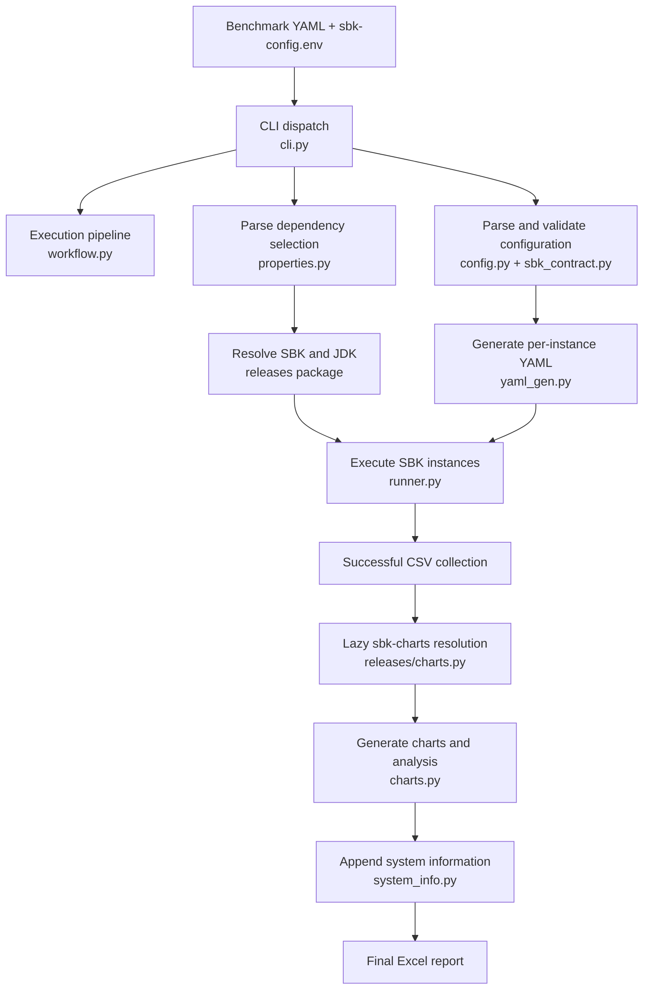

# Agent Documentation for sbk-analytics

This document provides comprehensive information for AI coding agents (GitHub Copilot, Devin, Cursor, etc.) to understand the sbk-analytics project structure, architecture, and development workflow.

## Project Overview

**sbk-analytics** is an orchestrator for SBK (Storage Benchmark Kit) benchmarks. It automates running multiple SBK benchmark instances and feeds the resulting CSV files into sbk-charts for combined performance analytics.

### Key Purpose
- Automate SBK benchmark execution (serial or parallel modes)
- Resolve and cache dependencies (JDK, SBK, sbk-charts)
- Generate Excel reports with performance charts and AI analysis
- Keep the application and sbk-charts runtimes isolated while supporting
  optional manual Conda/venv development hosts

## Project Structure

```
sbk-analytics/
├── analytics/                    # Main package directory
│   ├── __init__.py
│   ├── __main__.py              # Entry point for CLI
│   ├── banner.txt               # ASCII art banner
│   ├── default-sbk-config.env   # Installed-package configuration fallback
│   ├── cli.py                   # Command-line interface
│   ├── workflow.py              # Ordered benchmark/report pipeline
│   ├── config.py                # YAML configuration parsing
│   ├── errors.py                # User-facing dependency/config error types
│   ├── charts.py                # sbk-charts invocation
│   ├── properties.py            # .env file parsing
│   ├── policy.py                # Runtime policy and artifact registry
│   ├── releases/                # Dependency resolution package
│   │   ├── _shared.py           # Common cache/download/provenance primitives
│   │   ├── sbk.py               # SBK resolver
│   │   ├── charts.py            # sbk-charts resolver
│   │   └── jdk.py               # JDK resolver
│   ├── runner.py                # SBK execution (serial/parallel)
│   ├── processes.py             # Managed process trees and signal cleanup
│   ├── lifecycle.py             # Durable ownership and stale-run reconciliation
│   ├── _process_guard.py        # POSIX parent-death companion
│   ├── system_info.py           # System information collection
│   └── yaml_gen.py              # YAML generation for SBK instances
├── examples/                     # Example configuration files
│   ├── file-rocksdb-write-60s.yml
│   ├── file-rocksdb-write.yml
│   ├── local-rocksdb-smoke-test.yml # Fast SBK 10.6+ RocksDB validation
│   ├── config.yml
│   └── local-smoke-test.yml      # Fast local end-to-end validation
├── sbk-config.env              # SBK configuration (versions, URLs, folders)
├── sbk-bootstrap.env           # Linux/macOS launcher policy
├── sbk-analytics               # Canonical Linux/macOS launcher
├── sbk-analytics.sh            # Self-bootstrapping Linux/macOS launcher
├── sbk-config.local.env.example # Local-package configuration template
├── environment.yml              # Conda environment specification
├── requirements.txt             # Python dependencies
├── pyproject.toml               # Python package configuration
└── README.md                    # User documentation
```

## Core Components

### 1. CLI and Workflow Modules (`cli.py`, `workflow.py`)
**Purpose**: command parsing/dispatch plus an isolated execution pipeline

**Key Functions**:
- `main()`: Main entry point, orchestrates the entire workflow
- `_parse_args()`: Argument parsing using argparse
- `_setup_logging()`: Logging configuration
- `_print_banner()`: Displays ASCII art banner
- `_dependency_status()`: Read-only local/cache configuration report
- `_cleanup_benchmark_data()`: Safe, workdir-confined File-driver cleanup
- `_cleanup_workdir_before_run()`: Opt-in full workdir-content cleanup with
  protected-path refusal before SBK/SBK-GEM execution

**Commands and diagnostics**:
- `sbk-analytics deps status [--json]`: read-only; never installs/downloads
- `sbk-analytics deps doctor`: resolve and start-check all dependencies
- `sbk-analytics config init --output <path>`: create an editable local config
- `--resolve-only`: resolve dependencies without running a benchmark
- `--json`: emit exactly one JSON document on stdout; human and child-process
  output goes to stderr
- `--sbk-local`, `--sbk-charts-local`, and
  `--sbk-charts-executable`: one-run local overrides

**Usage**: Entry point for `sbk-analytics` command

### 2. Config Module (`config.py`)
**Purpose**: Parse and validate YAML configuration files

**Key Classes**:
- `OrchestratorConfig`: Main configuration class with attributes:
  - `mode`: Execution mode (serial/parallel)
  - `sbk_config`: SBK repository and version
  - `instances`: Parsed list of benchmark invocations declared under the
    canonical YAML `benchmarks:` key
  - `workdir`: Working directory for outputs
  - `ai_model`: AI model for analysis
  - `ai_params`: AI parameters
  - `chat`: Chat mode flag
  - `cleanup`: `never` (default) or `on-success`; cleanup supports only the
    File driver and only its `file`/`fname` path when contained by `workdir`
  - `cleanup_before_run`: boolean (default `false`); when true, removes every
    entry below the protected and resolved workdir immediately before workloads
    start

### 3. Properties Module (`properties.py`)
**Purpose**: Parse .env-style configuration files

**Key Functions**:
- `parse_properties()`: Parse .env files into key-value pairs
- Case-insensitive key matching
- Supports dots, underscores, and dashes interchangeably

**Important**: This is used for `sbk-config.env` file parsing

**Dependency settings** include local folders/executables, `downloads.folder`,
`ssl.verify`, `ssl.ca.bundle`, and `sbk.version.policy` /
`sbk-charts.version.policy` (`warn`, `exact`, or `ignore`). Versions are
conditionally required only when managed resolution is used.

**Security defaults**: TLS verification and SSH host-key verification are
disabled for compatibility with trusted benchmark labs. Keep the documented
`ssl.verify=false` and `SBK_ANALYTICS_BOOTSTRAP_TLS_VERIFY=false` defaults unless
the project requirement changes, clearly warn users about their trust
assumptions, and use `os.devnull` for portable SSH null known-host handling.
Do not imply that sbk-analytics independently checks the managed-Python archive:
the launcher checks uv, the lockfile records package artifact hashes, and the
pinned uv release owns managed-Python download integrity.

### 4. Releases Package (`releases/`)
**Purpose**: Dependency resolution and caching

**Key Functions**:
- `ensure_jdk()`: Resolve and cache JDK with priority order:
  1. SBK_JAVA_HOME (highest priority)
  2. JAVA_HOME
  3. java on PATH
  4. Specified jdk folder
  5. Download Temurin JDK
- `resolve_local_sbk()`: Validate a local SBK distribution or built checkout
- `resolve_local_sbk_charts()`: Validate a local sbk-charts checkout/environment
- `inspect_shared_sbk()` / `inspect_shared_sbk_charts()`: read-only status
  diagnostics; they never execute, build, install, or modify dependencies
- `_sbk_local_candidates()` / `_charts_local_candidates()`: canonical layout
  order shared by status inspection and runtime resolution; do not duplicate it
- `ensure_sbk()`: Prefer local SBK, otherwise use/download the release cache
- `ensure_sbk_charts()`: Prefer local sbk-charts, otherwise use its isolated,
  checksum-aware managed environment; never mutate the application runtime
- `cache_root()`: environment cache selection and platform default

Managed downloads use per-version locks, isolated staging directories,
validated executables, `metadata.json`, and a final `.ok` marker. JDK packages
must match the upstream published SHA-256 and configured Java major;
sbk-charts must pass a real command startup check before publication. Publishing is
atomic and lock-coordinated. Archive extraction rejects
traversal, links, devices, and FIFOs. GitHub SHA-256 asset digests are verified
when the API supplies one.

**Key Classes**:
- `JdkInstall`: JDK installation metadata
- `SbkInstall`: SBK installation metadata
- `ChartsInstall`: sbk-charts installation metadata

### Runtime Policy Module (`policy.py`)

**Purpose**: provide the single source of truth for application and managed
artifact identities plus operational defaults shared by multiple subsystems.

**Centralized policy groups**:
- application, SBK, sbk-charts, and JDK metadata
- dependency source/layout vocabulary, executable paths, environment variable
  names, command options, cache filenames, cache namespaces, and metadata keys
- CLI/JSON/lifecycle schemas, YAML and properties aliases, and the supported
  SBK option/migration contract
- GitHub, download, retry, pip trust, and dependency probe behavior
- shared display geometry, units, diagnostic limits, and signal exit convention
- host-platform identities, generated workflow paths, and Java output options
- process termination, durable SBK-native lifecycle, SSH/native probes, and
  timing
- configuration defaults, accepted values, and CLI exit codes

Version pins remain operator configuration in `sbk-config.env`; algorithm-local
constants remain next to their algorithms. New cross-cutting operational values
must be added to the appropriate immutable policy dataclass instead of directly
to a consumer module.

**Environment Variables Set**:
- `SBK_JAVA_HOME`: Points to resolved JDK (not JAVA_HOME to avoid conflicts)
- `JAVA_TOOL_OPTIONS`: Java system properties for unbuffered output (macOS fix)

### 5. Runner Module (`runner.py`)
**Purpose**: Execute SBK instances in serial or parallel mode

**Key Functions**:
- `run_jobs()`: Main entry point for running SBK instances
- `_run_serial()`: Execute instances one at a time
- `_run_parallel()`: Execute instances concurrently
- `_wait_for_native_completion()`: Trust SBK's authoritative completion

**Environment Configuration**:
- Sets `SBK_JAVA_HOME` to resolved JDK location
- Explicitly unsets `JAVA_HOME` to prevent version conflicts
- Prepends JDK bin directory to PATH
- Sets `JAVA_TOOL_OPTIONS` for unbuffered output on macOS

**macOS Logging Fix**:
- On macOS, captures and forwards SBK logs in real-time
- Uses line-buffered subprocess output
- Sets Java system properties to disable output buffering

### 6. YAML Generator Module (`yaml_gen.py`)
**Purpose**: Generate SBK YAML files from configuration

**Key Functions**:
- `generate_instance_yaml()`: Convert configuration to SBK YAML format
- Handles both sbk-yal and sbk-gem-yal formats

### Process Lifecycle Module (`processes.py`)
**Purpose**: Ensure SBK and sbk-charts descendants never outlive the local
sbk-analytics invocation

**Key behavior**:
- Starts each workload in an isolated POSIX session
- Uses a POSIX liveness-pipe guard for cleanup after abrupt parent death
- Treats guard/registry startup as mandatory and terminates a workload when
  durable ownership cannot be established
- Persists credential-free PID creation time, PGID, command, role, and GEM node
  metadata; later benchmark/doctor invocations reconcile only verified stale
  local groups and quarantine ambiguous records
- Handles SIGINT, SIGTERM, SIGHUP, and SIGQUIT with a
  3-second graceful window
- Registers an `atexit` fallback and escalates from tree TERM to tree KILL
- SBK-GEM owns embedded SBM and remote-client cleanup. Analytics allows native
  shutdown first and never issues a broad remote process-name kill

### 7. Charts Module (`charts.py`)
**Purpose**: Invoke sbk-charts for analytics

**Key Functions**:
- `run_sbk_charts()`: Run sbk-charts with all CSV files
- `_prepare_cwd()`: Create custom working directory for sbk-charts
- `_ai_args()`: Convert AI parameters to CLI flags

**Dependencies Required**:
- Pillow>=11.3 on Python 3.9, or Pillow>=12.0 on Python 3.10+ (for image handling in Excel files)
- openpyxl-image-loader>=1.0 (for image loading)

### 8. System Info Module (`system_info.py`)
**Purpose**: Collect system information for Excel reports

**Key Functions**:
- `append_system_sheet()`: Add system information sheet to Excel
- Collects CPU, RAM, OS, and hardware details

## Configuration Files

### sbk-config.env
**Purpose**: SBK configuration (versions, URLs, folders)

**Key Settings**:
```
sbk.url=https://github.com/kmgowda/SBK
sbk.version=10.6
# sbk.local.folder=/root/projects/SBK
downloads.folder=./.sbk
sbk.jdk.version=25
sbk.jdk.folder=./.jdk
ssl.verify=false
# ssl.ca.bundle=/path/to/company-ca.pem

sbk-charts.url=https://github.com/kmgowda/sbk-charts
sbk-charts.version=4.26.7.1
# sbk-charts.local.folder=/root/projects/sbk-charts
# sbk-charts.local.executable=/root/projects/sbk-charts/.venv/bin/sbk-charts
# sbk.version.policy=warn
# sbk-charts.version.policy=warn
```

**JDK Resolution Priority**:
1. SBK_JAVA_HOME (if set and matches version)
2. JAVA_HOME (if set and matches version)
3. java on PATH (if matches version)
4. Specified jdk folder (if cached version matches)
5. Download Temurin JDK

### environment.yml
**Purpose**: Conda environment specification

**Contents**:
- Python 3.10
- PyTorch (from pytorch channel)
- pyyaml
- requests

**Usage**: `conda env create -f environment.yml`

### YAML Configuration Files
**Purpose**: Benchmark configuration

**Structure**:
```yaml
mode: serial  # or parallel
sbk:
  url: https://github.com/kmgowda/SBK
  version: 10.0
benchmarks:
  - name: class_name
    params:
      # SBK-specific parameters
    class: driver_class
```

## Installation and Setup

### For Development
```bash
# Linux/macOS automatic environment setup
./sbk-analytics --version

# Create virtual environment
python -m venv .venv
source .venv/bin/activate

# Install dependencies
pip install -r requirements.txt

# Install in development mode
pip install -e .
```

### For Conda Users
```bash
# Create conda environment from environment.yml
conda env create -f environment.yml
conda activate sbk-analytics

# Install sbk-analytics
pip install -e .
```

### For Production
```bash
# Install from PyPI (when published)
pip install sbk-analytics
```

## Dependencies

### Required Python Packages
- PyYAML>=6.0
- requests>=2.28
- openpyxl>=3.1
- psutil>=5.9
- Pillow>=11.3 on Python 3.9, or Pillow>=12.0 on Python 3.10+ (for Excel image handling)
- openpyxl-image-loader>=1.0 (for image loading)

### External Dependencies
- **JDK**: Temurin/OpenJDK (auto-downloaded)
- **SBK**: Local ready-to-run checkout or auto-downloaded Storage Benchmark Kit
- **sbk-charts**: Local ready-to-run checkout or checksum-verified source
  archive installed into a dedicated managed environment

### Caching
All external dependencies are cached in:
- JDK: `.jdk/<version>/` or `./.jdk/`
- SBK: `.sbk/<version>/`
- sbk-charts: `.sbk/sbk-charts/<version>/`

Download-cache precedence is CLI `--downloads-folder`, explicit
`downloads.folder`, `SBK_ANALYTICS_DOWNLOADS_FOLDER` (or legacy
`SBK_ANALYTICS_CACHE`), then the platform cache. Local-package precedence is
CLI, environment, properties, then managed resolution. Explicit invalid local
selections never fall back to the network.

## Development Workflow

### Making Changes

1. **Code Style**: Follow PEP 8
2. **Testing**: Run example configurations
3. **Documentation**: Update relevant docstrings and README.md
4. **Dependencies**: Add to requirements.txt and pyproject.toml

### Key Design Decisions

1. **JDK Resolution**: select and validate once, then set SBK_JAVA_HOME only in
   the common SBK child environment without mutating the parent
2. **Environment Isolation**: Never modifies an active conda/venv and always
   keeps sbk-charts separate from the application runtime
3. **macOS Logging**: Special handling for Java output buffering
4. **Caching**: External dependencies cached to avoid re-downloads
5. **Error Handling**: Graceful degradation for missing dependencies
6. **Local packages**: Explicit shared folders are authoritative, validated,
   never built or modified, and never silently replaced by downloads. SBK
   development builds remain the responsibility of the SBK project workflow
7. **Lazy charts**: Normal runs resolve sbk-charts only after usable CSV input
8. **Machine output**: `--json` reserves stdout for one JSON document
9. **Process ownership**: SBK and charts launches must use `managed_popen()`;
   never introduce a direct `Popen`/`run` for long-lived workload commands
10. **Launcher bootstrap**: the extensionless `sbk-analytics` application
    dispatches to `sbk-analytics.sh` on Linux/macOS. Native Windows is not
    supported. The launcher acquires a pinned,
    SHA-256-verified uv executable, let uv acquire exact Python, and publish a
    non-editable `uv.lock` environment under per-user state. Active venv/Conda
    environments must never be modified. Runtime source/config/lock/platform
    fingerprints, forced local-package rebuilds, per-environment locks, health
    checks, and staged publication make first-run interruption and concurrent
    launch safe. Healthy environments run offline
11. **Central policy**: cross-cutting runtime defaults and managed-artifact
    identity/layout belong in `analytics/policy.py`; do not duplicate them in
    resolver, runner, process, CLI, or system-info modules. Pre-Python launcher
    pre-Python Bash defaults belong in `sbk-bootstrap.env`
12. **Durable ownership**: every long-lived local workload requires a mandatory
    guard plus a lifecycle record. Never signal a recorded PID without matching
    its creation time, PGID, and command; never persist GEM credentials

### Common Tasks

**Add new benchmark class**:
1. Update YAML configuration schema in `config.py`
2. Add example configuration in `examples/`
3. Test with `sbk-analytics -c examples/new-config.yml`

**Update SBK version**:
1. Modify `sbk.version` in `sbk-config.env`
2. Run `sbk-analytics` - it will auto-download the new version

**Update sbk-charts version**:
1. Modify `sbk-charts.version` in `sbk-config.env`
2. Run `sbk-analytics` - it will auto-install the new version

## Troubleshooting

### Common Issues

**JDK Version Mismatch**:
- Check `sbk.jdk.version` in sbk-config.env
- Verify SBK_JAVA_HOME is not pointing to wrong version
- Let sbk-analytics download the correct JDK

**macOS Logging Missing**:
- Use `--forward-logs` flag
- Check terminal buffering
- Ensure dependencies are installed

**sbk-charts Installation Fails**:
- Check network connectivity
- Verify SSL settings in sbk-config.env
- Try with `ssl.verify=false`

### Debug Mode

Run with verbose flag:
```bash
sbk-analytics -c config.yml -v
```

Run with extra verbose:
```bash
sbk-analytics -c config.yml -vv
```

## Release Process

### Version Bump
1. Update version in `pyproject.toml`
2. Update version in `analytics/__init__.py`
3. Commit changes

### Build Distribution
```bash
python -m build
```

### Test Release
```bash
pip install dist/sbk-analytics-*.tar.gz
sbk-analytics --version
sbk-analytics -c examples/config.yml
```

## Architecture Overview



## Important Notes for AI Agents

### When Modifying Code
- Always check if changes affect both conda and venv environments
- Test JDK resolution logic with different JAVA_HOME settings
- Verify macOS compatibility for any subprocess handling
- Run `tests.test_process_cleanup` after modifying process or signal handling
- Ensure dependency caching works correctly

### When Adding Features
- Consider impact on existing configurations
- Add examples to the `examples/` directory
- Update README.md with usage instructions
- Check if new dependencies need to be added to requirements.txt

### When Debugging Issues
- Use verbose flags to see detailed logging
- Check cache directories for dependency issues
- Verify environment variable settings
- Test with both serial and parallel modes

### File Naming Conventions
- Configuration files: `*.yml`, `*.env`
- Python modules: `*.py`
- Documentation: `*.md`
- Example files: `examples/`

### Environment Variables
- `CONDA_PREFIX`: Detects conda environment
- `SBK_JAVA_HOME`: Optional JDK input; selected value is set only for SBK children
- `JAVA_HOME`: User's JAVA_HOME (not modified by sbk-analytics)
- `PYTHONUNBUFFERED`: For unbuffered Python output
- `SBK_LOCAL_FOLDER`: Override the local SBK folder
- `SBK_CHARTS_LOCAL_FOLDER`: Override the local sbk-charts folder
- `SBK_CHARTS_LOCAL_EXECUTABLE`: Override the exact charts executable
- `SBK_ANALYTICS_DOWNLOADS_FOLDER`: Override the managed download cache when
  neither CLI nor properties selects one
- `SBK_ANALYTICS_CACHE`: Legacy alias for the download cache
- `SBK_ANALYTICS_ENV_HOME`: Override the persistent managed runtime root
- `SBK_ANALYTICS_BOOTSTRAP_OFFLINE`: Disallow bootstrap downloads during repair
- `SBK_ANALYTICS_UV_EXECUTABLE`: Trusted uv override for development/tests
- `SBK_ANALYTICS_SOURCE_ROOT`: Internal launcher handoff preserving the cloned
  repository's `sbk-config.env` while executing the installed package
- `SBK_ANALYTICS_LIFECYCLE_FOLDER`: Override durable workload registry location
- `SBK_ANALYTICS_RUN_ID`: Internal run identity propagated to owned local children

### Exit Codes
- `0`: Success
- `2`: All SBK instances failed and no existing CSV input was supplied
- `3`: sbk-charts did not produce the expected workbook
- `4`: System-sheet creation failed
- `5`: Configuration or dependency resolution failed
- Other: sbk-charts process exit code

## Contact and Support

- **GitHub**: https://github.com/kmgowda/sbk-analytics
- **Issues**: Report bugs via GitHub Issues
- **License**: Apache-2.0

## YAML Configuration Generation for AI Agents

This section provides comprehensive guidance for AI agents on how to generate valid YAML configuration files for sbk-analytics workloads.

### YAML Schema Overview

sbk-analytics uses YAML configuration files to define benchmark workloads. The schema consists of several key sections:

```yaml
mode: serial | parallel              # Execution mode
workdir: /path/to/workdir           # Working directory for outputs

sbk:                                # Shared SBK parameters (defaults for all instances)
  seconds: 60
  size: 100
  time: ms
  writers: 1

benchmarks:                          # List of benchmark instances
  - class: file
    file: /tmp/benchmark.dat
  - class: rocksdb
    rfile: /tmp/benchmark

class_params:                       # Optional per-class defaults
  file: {writers: 1}
  rocksdb: {writers: 1}

sbk-charts:                         # sbk-charts options
  output: results.xlsx
  ai_model: noai
  ai_params: {}
  chat: false
  use_files: []                     # Optional pre-existing CSV files
```

### Parameter Resolution Order

Parameters are resolved in the following order (lowest to highest precedence):

1. **Shared `sbk:` block** - Defaults for ALL instances
2. **`class_params[<class>]`** - Per-class defaults (if specified)
3. **Instance's own keys** - Per-instance overrides in `benchmarks:` list
4. **Orchestrator-managed** - `class`, `csvfile=<unique-path>`, and the
   SBK-mode-specific CSV logger (`CSVLogger` for YAL,
   `GemPrometheusLogger` for GEM-YAL)

This means an instance only needs to specify parameters that differ from the shared defaults.

### Benchmark Classes and Parameters

#### Common SBK Parameters

These parameters can be specified in the `sbk:` block or per-instance:

- `seconds: <int>` - Benchmark duration in seconds
- `size: <int>` - Record size in bytes
- `time: ns|ms|us|s` - Time unit for operations
- `writers: <int>` - Number of writer threads
- `readers: <int>` - Number of reader threads
- `nodes: <list|string>` - Cluster nodes (triggers sbk-gem-yal mode)
- `recordcount: <int>` - Total number of records
- `operations: <int>` - Total number of operations
- `warmup: <int>` - Warmup duration in seconds

#### Storage Driver Classes

**File Driver (`file`)**
```yaml
- class: file
  file: /path/to/file.dat        # Required: file path
  # Optional: inherits from sbk: block
  writers: 1
  readers: 1
```

**RocksDB Driver (`rocksdb`)**
```yaml
- class: rocksdb
  rfile: /path/to/db             # Required: RocksDB directory
  # Optional: inherits from sbk: block
  writers: 1
  readers: 1
```

**HDFS Driver (`hdfs`)**
```yaml
- class: hdfs
  uri: hdfs://namenode:9000      # Required: HDFS URI
  fname: /path/in/hdfs           # Required: HDFS file path
  # Optional: inherits from sbk: block
  writers: 1
```

**Kafka Driver (`kafka`)**
```yaml
- class: kafka
  brokers: localhost:9092       # Required: Kafka brokers
  topic: benchmark-topic        # Required: Kafka topic
  # Optional: inherits from sbk: block
  writers: 1
  readers: 1
```

**Pulsar Driver (`pulsar`)**
```yaml
- class: pulsar
  service_url: pulsar://localhost:6650  # Required: Pulsar service URL
  topic: persistent://public/default/benchmark  # Required: Pulsar topic
  # Optional: inherits from sbk: block
  writers: 1
  readers: 1
```

**Cassandra Driver (`cassandra`)**
```yaml
- class: cassandra
  host: localhost               # Required: Cassandra host
  port: 9042                    # Required: Cassandra port
  keyspace: benchmark_ks        # Required: Keyspace name
  table: benchmark_table        # Required: Table name
  # Optional: inherits from sbk: block
  writers: 1
  readers: 1
```

### YAML Declaration Styles

#### Style A: Simple Class List (Legacy)
```yaml
benchmarks: [file, rocksdb, hdfs]
class_params:
  file: {file: /tmp/file.dat, writers: 1}
  rocksdb: {rfile: /tmp/rocksdb, writers: 1}
  hdfs: {uri: hdfs://localhost:9000, fname: /tmp/hdfs, writers: 1}
```

#### Style B: Detailed Instance List (Recommended)
```yaml
benchmarks:
  - class: file
    file: /tmp/file.dat
    writers: 1
  - class: rocksdb
    rfile: /tmp/rocksdb
    writers: 1
  - class: hdfs
    uri: hdfs://localhost:9000
    fname: /tmp/hdfs
    writers: 1
```

#### Style C: Mixed with Custom Names
```yaml
benchmarks:
  - class: file
    name: file-write-heavy
    file: /tmp/file.dat
    writers: 4
  - class: file
    name: file-read-light
    file: /tmp/file.dat
    readers: 2
  - class: rocksdb
    name: rocksdb-standard
    rfile: /tmp/rocksdb
```

### Common Workload Patterns

#### Pattern 1: Single-Writer Comparison
Compare different storage systems with identical write patterns:
```yaml
mode: serial
sbk:
  seconds: 60
  size: 1000
  writers: 1
benchmarks:
  - class: file
    file: /tmp/benchmark/file.dat
  - class: rocksdb
    rfile: /tmp/benchmark/rocksdb
  - class: hdfs
    uri: hdfs://localhost:9000
    fname: /tmp/benchmark/hdfs
```

#### Pattern 2: Read-Write Mix
Test both read and write operations:
```yaml
mode: serial
sbk:
  seconds: 60
  size: 100
benchmarks:
  - class: file
    name: file-write
    file: /tmp/benchmark/file.dat
    writers: 1
  - class: file
    name: file-read
    file: /tmp/benchmark/file.dat
    readers: 1
  - class: rocksdb
    name: rocksdb-write
    rfile: /tmp/benchmark/rocksdb
    writers: 1
  - class: rocksdb
    name: rocksdb-read
    rfile: /tmp/benchmark/rocksdb
    readers: 1
```

#### Pattern 3: Scalability Test
Vary the number of writers to test scalability:
```yaml
mode: parallel
sbk:
  seconds: 60
  size: 100
benchmarks:
  - class: file
    name: file-1-writer
    file: /tmp/benchmark/file-1.dat
    writers: 1
  - class: file
    name: file-2-writers
    file: /tmp/benchmark/file-2.dat
    writers: 2
  - class: file
    name: file-4-writers
    file: /tmp/benchmark/file-4.dat
    writers: 4
  - class: file
    name: file-8-writers
    file: /tmp/benchmark/file-8.dat
    writers: 8
```

#### Pattern 4: Record Size Variation
Test performance with different record sizes:
```yaml
mode: serial
sbk:
  seconds: 60
  writers: 1
benchmarks:
  - class: file
    name: file-100b
    file: /tmp/benchmark/file-100b.dat
    size: 100
  - class: file
    name: file-1kb
    file: /tmp/benchmark/file-1kb.dat
    size: 1024
  - class: file
    name: file-10kb
    file: /tmp/benchmark/file-10kb.dat
    size: 10240
  - class: file
    name: file-100kb
    file: /tmp/benchmark/file-100kb.dat
    size: 102400
```

#### Pattern 5: Cluster/Distributed Benchmark
Use sbk-gem-yal for distributed testing:
```yaml
mode: serial
sbk:
  seconds: 60
  size: 100
  writers: 1
  nodes: ["node1:8080", "node2:8080", "node3:8080"]  # Triggers sbk-gem-yal
benchmarks:
  - class: file
    file: /tmp/benchmark/file.dat
  - class: rocksdb
    rfile: /tmp/benchmark/rocksdb
```

### YAML Generation Best Practices

#### 1. Use Shared Defaults
Minimize repetition by using the `sbk:` block for common parameters:
```yaml
# Good
sbk:
  seconds: 60
  size: 100
  writers: 1
benchmarks:
  - class: file
    file: /tmp/file.dat
  - class: rocksdb
    rfile: /tmp/rocksdb

# Avoid repetition
benchmarks:
  - class: file
    seconds: 60
    size: 100
    writers: 1
    file: /tmp/file.dat
  - class: rocksdb
    seconds: 60
    size: 100
    writers: 1
    rfile: /tmp/rocksdb
```

#### 2. Use Descriptive Instance Names
When using Style B, provide meaningful names:
```yaml
benchmarks:
  - class: file
    name: file-write-4k-records
    file: /tmp/file.dat
    size: 4096
  - class: rocksdb
    name: rocksdb-read-1k-records
    rfile: /tmp/rocksdb
    size: 1024
```

#### 3. Ensure File Path Existence
Make sure parent directories exist for file paths:
```yaml
# Use workdir for consistent file locations
workdir: /tmp/sbk-analytics
benchmarks:
  - class: file
    file: /tmp/sbk-analytics/file.dat    # Parent will be created
  - class: rocksdb
    rfile: /tmp/sbk-analytics/rocksdb   # Parent will be created
```

#### 4. Choose Appropriate Execution Mode
- **Serial**: Use for debugging or when resources are limited
- **Parallel**: Use for independent benchmarks to speed up execution

#### 5. Validate YAML Structure
Ensure required parameters are present for each class:
- `file`: Requires `file` parameter
- `rocksdb`: Requires `rfile` parameter
- `hdfs`: Requires `uri` and `fname` parameters
- `kafka`: Requires `brokers` and `topic` parameters
- `pulsar`: Requires `service_url` and `topic` parameters
- `cassandra`: Requires `host`, `port`, `keyspace`, and `table` parameters

### Validation Rules

AI agents should validate YAML configurations against these rules:

1. **Required Top-Level Keys**: `benchmarks` must be present and non-empty.
   Legacy `classes` is accepted with a deprecation warning but must never be
   combined with `benchmarks` in the same file.
2. **Valid Mode**: `mode` must be `serial` or `parallel`
3. **Valid AI Model**: `ai_model` must be one of `huggingface`, `ollama`, `lmstudio`, `noai`
4. **Unique Instance Names**: All instance names must be unique
5. **Class-Specific Parameters**: Each storage class must have its required parameters
6. **File Path Safety**: File paths should be absolute or relative to workdir
7. **Numeric Parameters**: Numeric parameters should be positive integers
8. **Time Units**: `time` parameter should be one of `ns`, `ms`, `us`, `s`

### AI Agent YAML Generation Workflow

When generating YAML configurations, AI agents should follow this workflow:

1. **Understand the Benchmark Goal**
   - What storage systems are being compared?
   - What operations (read/write/mixed) are being tested?
   - What variables (size, threads, duration) are being tested?

2. **Choose Execution Mode**
   - Use `serial` for debugging or resource-constrained environments
   - Use `parallel` for independent benchmarks

3. **Set Shared Defaults**
   - Define common parameters in the `sbk:` block
   - Include duration, record size, and default thread counts

4. **Define Benchmark Instances**
   - Use Style B (detailed instance list) for clarity
   - Provide descriptive names for each instance
   - Specify only parameters that differ from defaults

5. **Configure sbk-charts**
   - Set appropriate output filename
   - Choose AI model if analysis is needed
   - Add any pre-existing CSV files via `use_files`

6. **Validate the Configuration**
   - Check all required parameters are present
   - Ensure file paths are appropriate
   - Verify instance names are unique
   - Confirm mode and AI model are valid

### Example: AI Agent YAML Generation

**User Request**: "Create a benchmark comparing file and rocksdb write performance with 1, 2, and 4 writers, running for 60 seconds with 1KB records."

**AI Agent Response**:
```yaml
mode: parallel
workdir: /tmp/sbk-analytics

sbk:
  seconds: 60
  size: 1024                    # 1KB records
  time: ms
  writers: 1                    # Default, will be overridden

benchmarks:
  # File driver with varying writers
  - class: file
    name: file-1-writer
    file: /tmp/sbk-analytics/file-1w.dat
    writers: 1
  - class: file
    name: file-2-writers
    file: /tmp/sbk-analytics/file-2w.dat
    writers: 2
  - class: file
    name: file-4-writers
    file: /tmp/sbk-analytics/file-4w.dat
    writers: 4
  
  # RocksDB driver with varying writers
  - class: rocksdb
    name: rocksdb-1-writer
    rfile: /tmp/sbk-analytics/rocksdb-1w
    writers: 1
  - class: rocksdb
    name: rocksdb-2-writers
    rfile: /tmp/sbk-analytics/rocksdb-2w
    writers: 2
  - class: rocksdb
    name: rocksdb-4-writers
    rfile: /tmp/sbk-analytics/rocksdb-4w
    writers: 4

sbk-charts:
  output: file-rocksdb-scalability.xlsx
  ai_model: noai
```

### Advanced YAML Features

#### Using class_params for Per-Class Defaults
```yaml
sbk:
  seconds: 60
  size: 100

class_params:
  file: {writers: 1, readers: 0}
  rocksdb: {writers: 1, readers: 0}

benchmarks:
  - class: file
    file: /tmp/file.dat           # Inherits writers: 1, readers: 0
  - class: rocksdb
    rfile: /tmp/rocksdb          # Inherits writers: 1, readers: 0
```

#### Combining with Existing CSV Files
```yaml
sbk-charts:
  output: comparison.xlsx
  use_files:
    - /data/baseline/file-baseline.csv
    - /data/baseline/rocksdb-baseline.csv
```

#### AI Analytics Integration
```yaml
sbk-charts:
  output: analysis.xlsx
  ai_model: huggingface
  ai_params:
    model: "mistralai/Mistral-7B-Instruct-v0.2"
    temperature: 0.7
  chat: true
```

### Troubleshooting YAML Generation

**Common Issues and Solutions**:

1. **Missing Required Parameters**: Ensure each storage class has its required parameters
2. **Duplicate Instance Names**: Use unique `name:` values for each instance
3. **Invalid File Paths**: Use absolute paths or paths relative to workdir
4. **Wrong Execution Mode**: Use `parallel` for independent benchmarks, `serial` for dependent ones
5. **Parameter Override Issues**: Remember parameter resolution order when debugging

## Version History

- **1.26.9.1**: Current main version
  - JDK resolution with priority order
  - Isolated managed runtime plus optional manual Conda/venv development
  - macOS logging fixes
  - Excel output with system information
  - AI analytics integration
  - Apache 2.0 license headers added
  - Comprehensive documentation for AI agents

## Related Documentation

- **[README.md](../README.md)** - User documentation and quick start guide
- **[CONTRIBUTING.md](CONTRIBUTING.md)** - Contribution guidelines
- **[ARCHITECTURE.md](ARCHITECTURE.md)** - High-level architecture overview
- **[DEVELOPMENT.md](DEVELOPMENT.md)** - Quick development reference
- **[SUPPORT.md](SUPPORT.md)** - Help and troubleshooting guide
