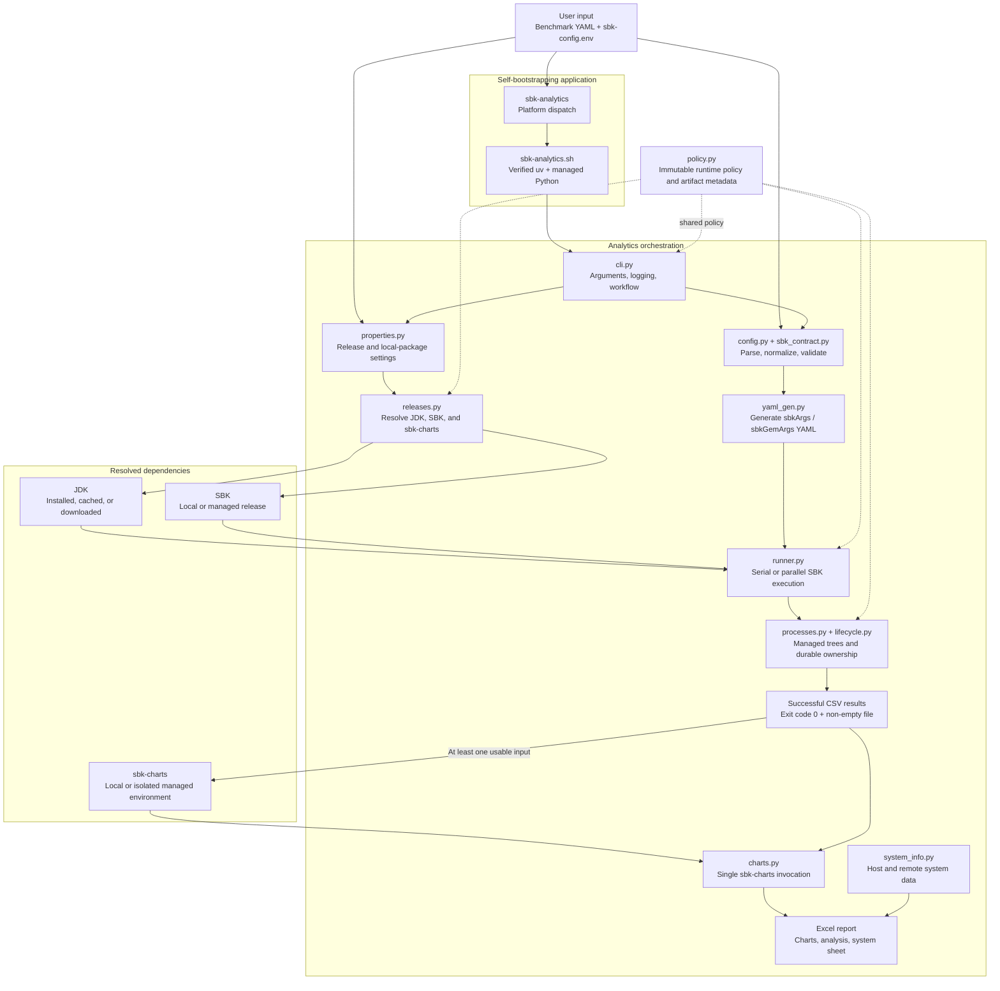
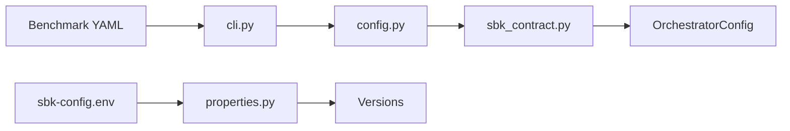
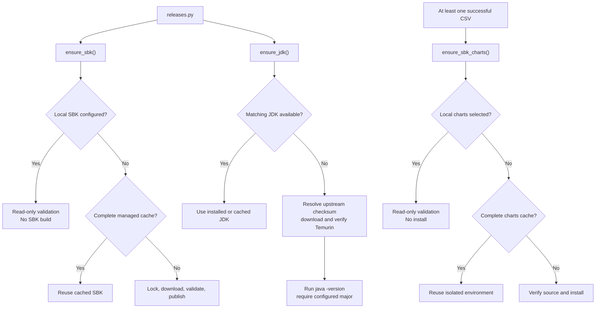
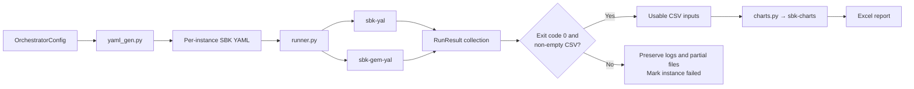
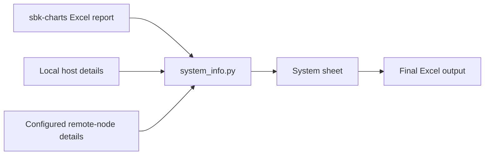
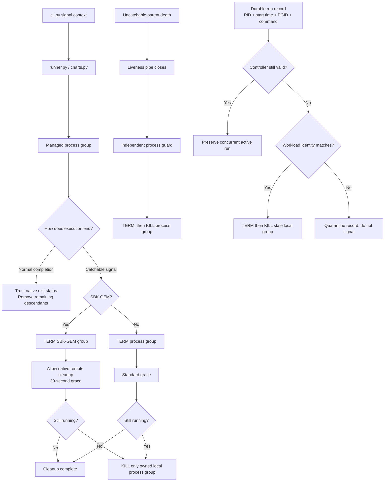
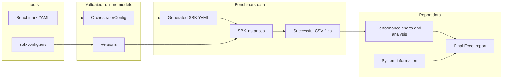

# Architecture Overview

This document provides a high-level architectural overview of sbk-analytics.

## System Architecture

The extensionless `sbk-analytics` application is the canonical Linux/macOS
launcher and dispatches to `sbk-analytics.sh`. Native Windows is not supported.
These stage-zero layers need no system Python or Conda: they acquire
a pinned uv binary with a checked-in platform SHA-256, install exact managed
Python, and build a non-editable `uv.lock` environment in persistent per-user
state. Fingerprinted environments are lock-coordinated, health-checked, and
staged before publication. Runtime source and configuration inputs participate
in the fingerprint, and each new environment forces a fresh local-package
build rather than accepting a cached wheel. Bash replaces itself with safe-path Python.

`policy.py` is the dependency-free policy boundary used by the CLI,
configuration parser, resolver, runner, process manager, charts adapter, and
system-info collector. Immutable typed policy groups centralize values that
cross module boundaries, including dependency layouts/provenance, executable
and environment names, configuration aliases, SBK option contracts,
cache/lifecycle/diagnostic schemas, native command interfaces, units, status
vocabulary, and timeouts. `sbk-config.env` remains the operator-controlled source for release
version pins and local dependency selections.
The native launchers load their smaller pre-Python policy boundary from
`sbk-bootstrap.env`, because `analytics.policy` cannot be imported until a
compatible interpreter and environment exist.

## Component Interactions

### 1. Configuration Flow

### 2. Dependency Resolution Flow

Explicit local SBK validation happens before JDK resolution. sbk-charts is
lazy during normal runs, so a failed SBK workload does not trigger a charts
install. `deps doctor` intentionally resolves and starts all three tools.
Shared-folder resolution never builds SBK or performs a managed release install
into either checkout; the owning development workflow must prepare runnable
commands first. A selected sbk-charts source launcher owns its isolated runtime.
Archive members are checked before extraction, and managed installs are
published only after executable validation and metadata creation. Directory
publication is atomic and coordinated by a per-version lock.

### 3. Execution Flow

### 4. Post-Processing Flow

### 5. Process Lifecycle Flow

Every SBK and sbk-charts invocation is registered in memory and in a durable,
credential-free per-user ownership registry until its process tree exits.
Guard and registry creation are fail-closed. A later benchmark or `deps doctor`
reconciles stale records only after PID creation time, process group, and
command identity all match. Normal wrapper exit also triggers removal of any
remaining descendants in its workload group.

SBK-GEM owns normal deployment, benchmark timing, failure reporting, embedded
SBM, and remote cleanup. Catchable GEM interruptions allow native cleanup
first. Analytics never uses a global remote process-name kill because it cannot
distinguish concurrent runs; it records remote node names for diagnostics but
does not persist credentials.

## Key Design Decisions

### 1. JDK Resolution Priority
**Decision**: SBK_JAVA_HOME > JAVA_HOME > PATH > cached > download

**Rationale**: 
- Allows explicit JDK specification via SBK_JAVA_HOME
- Respects user's JAVA_HOME but doesn't override it
- Provides fallback to PATH and cached versions
- Auto-downloads as last resort

### 2. Environment Separation
**Decision**: Isolate application, sbk-charts, and JDK/SBK runtimes

**Rationale**:
- Prevents active venv/Conda environments from being modified
- Prevents sbk-charts dependency upgrades from changing sbk-analytics
- Makes the exact application runtime reusable offline after first bootstrap
- Avoids conflicts with user's JAVA_HOME
- Allows SBK to use specific JDK version
- Maintains user's environment integrity

### 3. Caching Strategy
**Decision**: Cache all external dependencies

**Rationale**:
- Reduces network requests
- Improves performance
- Enables offline operation after initial download
- Simplifies version management
- Verifies uv platform artifacts and the shipped sbk-charts source archive

### 4. Execution Modes
**Decision**: Support both serial and parallel execution

**Rationale**:
- Serial: Easier debugging, resource-friendly
- Parallel: Faster execution for independent benchmarks
- User choice based on requirements

### 5. sbk-charts Invocation
**Decision**: Invoke once with all CSVs, not per-instance

**Rationale**:
- Combined analytics across all instances
- Single Excel report with comparisons
- More efficient resource usage
- Better for trend analysis

## Data Flow

## Error Handling Strategy

### Graceful Degradation
- Failed SBK instances don't stop execution
- Only successful, non-empty CSV results are sent to sbk-charts
- Missing dependencies trigger auto-download

### Error Propagation
- Configuration errors: Fail fast
- Dependency errors: Clear error messages
- Execution errors: Log and continue if possible

### Logging Strategy
- Configurable verbosity (-v, -vv)
- Separate logs for parallel execution
- Real-time log forwarding on macOS

## Performance Considerations

### Caching
- JDK: Cached by version
- SBK: Cached by version
- sbk-charts: Cached by version
- Explicit local SBK/sbk-charts folders bypass managed caches and are never modified

### Parallel Execution
- Concurrent SBK instances
- Independent CSV collection
- Single sbk-charts invocation

### Resource Management
- SBK-native benchmark lifecycle and authoritative completion status
- Managed process-tree and parent-death cleanup
- Resource cleanup on exit

## Security Considerations

### Dependency Sources
- GitHub releases (SBK, sbk-charts)
- Temurin JDK (official builds)
- SSL verification (configurable)

### File Operations
- Workdir isolation
- Permission checks
- Safe file handling

### Environment Variables
- SBK_JAVA_HOME set only in validated SBK child environments
- JAVA_HOME not modified
- User environment respected

## Extensibility Points

### Adding New Benchmark Classes
1. Update `config.py` schema
2. Update `yaml_gen.py` generation logic
3. Add example configurations

### Adding New Analytics
1. Update `charts.py` parameters
2. Update sbk-charts invocation
3. Update documentation

### Adding New Platforms
1. Update `runner.py` platform detection
2. Add platform-specific handling
3. Test and document

## Technology Stack

### Python
- **Version**: 3.9+
- **Package Manager**: pip/conda
- **Key Libraries**: PyYAML, requests, openpyxl, psutil

### External Dependencies
- **JDK**: Temurin/OpenJDK
- **SBK**: Java-based storage benchmark
- **sbk-charts**: Python-based analytics

### Platforms
- **Primary**: Linux
- **Supported**: macOS (with special handling)
- **Not supported**: Native Windows

## Monitoring and Observability

### Logging
- Structured logging with levels
- Configurable verbosity
- Per-instance logs (parallel mode)

### Metrics
- Execution time per instance
- Success/failure rates
- Resource usage (via system_info)

### Debugging
- Verbose mode for detailed logs
- Log file preservation
- Error context preservation

For more detailed information, see [AGENTS.md](AGENTS.md).
