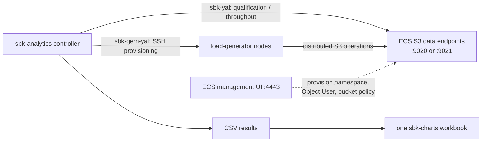

# MinIO, Dell ECS, and ObjectScale benchmarks

These persistent workflows exercise SBK's `minio` class against an
S3-compatible service. The supplied ECS/OBS examples use the four HTTP data
endpoints in the authorized lab and the dedicated `sbk-ns` namespace. They do
not contain management, SSH, or S3 credentials.

## Credential and endpoint contract

Export credentials only in the launching shell. SBK 10.7 reads these variables
when `key`, `secret`, or `gempass` are absent from the generated SBK YAML:

```bash
export SBK_S3_ACCESS_KEY='<dedicated ECS Object User>'
export SBK_S3_SECRET_KEY='<Object User secret>'
export SBK_GEM_SSH_PASSWD='<load-generator SSH password>' # GEM only
```

The ECS management account is not an S3 identity. Use it only to provision a
dedicated namespace/Object User. Do not add any secret to a committed workflow,
terminal transcript, generated report, or issue.

ECS normally exposes S3 over HTTP `9020` or HTTPS `9021`. A root request should
identify the data plane with S3 XML—often HTTP 403 `AccessDenied`. HTML,
management JSON, or HTTP 405 usually means the wrong port.

## ECS/OBS preparation

Use the ECS management UI only for control-plane setup:

1. Sign in to the management endpoint on port `4443` with an authorized
   administrator account.
2. Create or select a benchmark-only namespace. The lab workflows use
   `sbk-ns`.
3. Create a benchmark-only S3 Object User in that namespace and generate its
   secret key. An ECS management user is not an S3 Object User.
4. Grant only the bucket permissions required by the test. Export the Object
   User name and secret through `SBK_S3_ACCESS_KEY` and
   `SBK_S3_SECRET_KEY` in the controller shell.
5. Use a dedicated bucket. The examples use `sbk-analytics-ecs-obs`; SBK can
   create it on the first PUT when the Object User has permission.

For another MinIO, ECS, or ObjectScale installation, copy a workflow outside
the repository and replace the `url` endpoint pool, `bucket`, namespace header,
and GEM node inventory. A native MinIO deployment normally does not need the
ECS-specific `x-emc-namespace` header.

## SBK 10.7 workflow contract

SBK 10.7 removes the separate `endpoints` option. `url` now accepts either one
S3 URL or a comma-separated pool distributed round-robin across workers.
Persistent workflows should use only `url`. For compatibility, sbk-analytics
migrates an old `endpoints` value when `url` is absent and rejects both keys
together as ambiguous.

The committed workflows enable `endpoint-preflight: all` and
`endpoint-metrics: true`. Preflight checks every configured URL before timing;
endpoint metrics retain per-URL logical operations, bytes, retries, and
terminal failures. The workflows begin with one-attempt retry policy so
backend saturation is not hidden by client retries.

SBK 10.7 also supports these persistent workload controls:

| Goal | YAML options |
| --- | --- |
| Reproducible object sizes | `object-size-distribution: fixed|uniform:min:max|sweep:min:max|weighted:...` and `data-seed` |
| Reproducible key layout | `key-distribution: sequential|hashed|random`, optional `partition-by-prefix` |
| Range GET shape | `range-offset-distribution`, `range-window-length`, `range-alignment` |
| LIST shape | `list-max-keys`, `list-max-entries`, `list-api-version`, delimiter/start-after/owner/metadata controls |
| Retry policy | `retry-max-attempts`, `retry-strategy`, `retry-backoff-ms`, `retry-max-backoff-ms`, `retry-jitter` |
| Untimed connection/data warm-up | `warmup-requests` and `warmup-operation: connection|put|get|put-get` |
| Audit record | `run-manifest` writes a credential-free effective-workload JSON file |

`mixed-read-source` accepts only `catalog`; the unsafe former `published` mode
is intentionally rejected. `auth-version` accepts only SigV4 value `4`.
SBK remains authoritative for numeric bounds, catalog capacity, multipart,
async-memory, operation-mix, permissions, and backend-state validation.



## Workflow order

1. Run `ecs-obs-qualification.yml`. Its fixed counts qualify PUT, GET, Range
   GET, LIST, multipart drain, CSV production, and sbk-charts in one serial
   workflow.
2. Run `ecs-obs-throughput.yml` only after qualification. It sends a short
   30-second PUT and GET load across all four data endpoints.
3. Run `ecs-obs-gem.yml` only after the exact ordinary workload succeeds from
   every listed load generator and controller-to-node SSH works.

```bash
./sbk-analytics -c examples/benchmarks/minio/ecs-obs-qualification.yml
./sbk-analytics -c examples/benchmarks/minio/ecs-obs-throughput.yml
./sbk-analytics -c examples/benchmarks/minio/ecs-obs-gem.yml
```

`cleanup_before_run` only clears the local analytics work directory. It does
not remove ECS objects or buckets. Each benchmark uses an explicit prefix so
test data remains attributable. Do not add `recreate`, delete, or bucket-delete
to a persistent workflow unless the exact disposable target is independently
approved.

## Reading results

Treat a run as valid only when all of these hold:

- sbk-analytics, SBK/SBK-GEM, and sbk-charts exit successfully;
- every requested fixed record is present in the Total result;
- output contains no S3/I/O failures or unexpected retries;
- read-size verification succeeds and no invalid/discarded latency appears;
- the load generator is not the unintended bottleneck;
- the raw CSV, generated workbook, exact workflow, dependency provenance, and
  cluster/load-host context are retained together.

PUT/GET report object operations and payload throughput. Range GET reports the
selected range bytes. LIST's byte rate is the logical size of listed objects,
not response-wire bandwidth; compare LIST operations/sec and latency instead.
For credible performance claims, warm up first and run at least three measured
repetitions long enough to reach steady state. The short shipped workflows are
qualification examples, not product performance specifications.

## SBK 10.7 lab validation

The current workflows were validated on 2026-09-09 against ECS endpoints
`10.236.66.181` through `.184`, using SBK 10.7, Temurin JDK 25.0.2, and the
managed sbk-charts 4.26.7.1 package. The managed SBK archive was resolved from
GitHub tag `v10.7` and passed its published SHA-256 check. Credentials came
from a dedicated Object User in `sbk-ns`; no credential was written to the
repository, workflow, report, or test log.

The fixed-count qualification passed all five instances (PUT, GET, Range GET,
LIST, and multipart PUT), produced five CSV files, and generated
`ecs-obs-qualification.xlsx`. The four-endpoint workflow passed both 30-second
instances, reported operations on every configured endpoint with zero retries
and zero terminal failures, produced two CSV files, and generated
`ecs-obs-throughput.xlsx`.

| Workflow / operation | Load | Records | MB/s | Records/s | Average | p95 | p99 |
| --- | ---: | ---: | ---: | ---: | ---: | ---: | ---: |
| Qualification PUT | 1 writer, 1 MiB, fixed | 20 | 1.46 | 1.5 | 686.4 ms | 2097 ms | 2097 ms |
| Qualification GET | 1 reader, 1 MiB, fixed | 20 | 2.75 | 2.8 | 363.3 ms | 1921 ms | 1921 ms |
| Qualification Range GET | 1 reader, 4 KiB range, fixed | 20 | 0.01 | 3.5 | 281.8 ms | 285 ms | 285 ms |
| Qualification LIST | 1 reader, fixed | 5 | n/a¹ | 3.1 | 317.0 ms | 382 ms | 382 ms |
| Qualification multipart PUT | 1 writer, 15 MiB object / 5 MiB parts | 2 | 5.07 | 0.3 | 2942.5 ms | 4003 ms | 4003 ms |
| Four-endpoint PUT | 4 writers, 1 MiB, 30 s | 193 | 5.96 | 6.0 | 661.0 ms | 2097 ms | 2322 ms |
| Four-endpoint GET | 4 readers, 1 MiB, 30 s | 326 | 10.85 | 10.9 | 366.7 ms | 679 ms | 2066 ms |

¹ LIST byte rate is not response-wire throughput; use operations/sec and
latency for comparisons.

These are single-run integration results, not capacity claims. The controller
could reach all four S3 endpoints, but TCP port 22 remained unreachable on all
eight supplied load generators (`10.236.65.98` through `.105`). The documented
GEM precondition therefore failed and the distributed workflow was not
started. Restore controller-to-client SSH routing, validate the ordinary
workload independently from every client, and then run `ecs-obs-gem.yml`.

## Historical SBK 10.6 lab record

On 2026-09-02 all four supplied endpoints (`10.236.66.181` through `.184`) on
port `9020` returned HTTP 403 with `application/xml`, confirming reachable S3
data-plane services. Management authentication on `.181:4443` succeeded and
reported the existing `sbk-ns` namespace.

The controller could not route to SSH port 22 on any supplied load generator
(`10.236.65.98` through `.105`), so distributed SBK-GEM performance results
must not be claimed from that attempt. After correcting analytics to select
the GEM `GemPrometheusLogger`, GEM reached its SSH connection phase, reported
`No route to host` for the nodes, exited non-zero, skipped charts because no CSV
was produced, and left no locally running SBK/GEM process.

| Scenario | Status | Evidence |
| --- | --- | --- |
| Four ECS S3 endpoints | Qualified preflight | HTTP 403, `application/xml`, 0.27–0.28 s connect, 0.54–0.56 s total |
| ECS management | Qualified preflight | Login HTTP 200; `sbk-ns` discovered |
| SBK 10.6 MinIO contract | Qualified end to end | Environment credentials, fixed/timed, multipart, Range GET, LIST, and multi-endpoint workflows completed; see the endpoint-metrics limitation below |
| Qualification workflow | Passed | 5/5 SBK instances passed; 5 CSV files and `ecs-obs-qualification.xlsx` created |
| Throughput workflow | Passed | PUT and GET passed; 2 CSV files and `ecs-obs-throughput.xlsx` created |
| SBK-GEM load nodes | Blocked | SSH returned `No route to host` for all eight supplied nodes |

### Example results

These results were produced on 2026-09-02 by the committed workflows from one
controller using SBK 10.6, Temurin JDK 25.0.2, and the managed sbk-charts
package. They demonstrate a working workflow and provide a regression
reference only; they are not an ECS capacity or product benchmark. Each
scenario was run once, without a controlled warm-up or a recorded ECS health
snapshot.

| Workflow / operation | Load | Records | MB/s | Records/s | Average | p95 | p99 |
| --- | ---: | ---: | ---: | ---: | ---: | ---: | ---: |
| Qualification PUT | 1 writer, 1 MiB, fixed | 20 | 1.64 | 1.6 | 608.6 ms | 1845 ms | 1845 ms |
| Qualification GET | 1 reader, 1 MiB, fixed | 20 | 2.05 | 2.1 | 486.8 ms | 2296 ms | 2296 ms |
| Qualification Range GET | 1 reader, 4 KiB range, fixed | 20 | 0.02 | 3.9 | 257.2 ms | 261 ms | 261 ms |
| Qualification LIST | 1 reader, fixed | 5 | n/a¹ | 3.2 | 314.6 ms | 380 ms | 380 ms |
| Qualification multipart PUT | 1 writer, 15 MiB object / 5 MiB parts | 2 | 2.54 | 0.2 | 5895.0 ms | 8427 ms | 8427 ms |
| Four-endpoint PUT | 4 writers, 1 MiB, 30 s | 187 | 6.23 | 6.2 | 633.7 ms | 676 ms | 2696 ms |
| Four-endpoint GET | 4 readers, 1 MiB, 30 s | 300 | 10.00 | 10.0 | 395.3 ms | 580 ms | 2546 ms |

¹ SBK reports a logical LIST MB rate, but it is not response-wire throughput;
use operations/sec and latency for LIST comparisons.

The charts installer identified the configured GitHub source tag as
`4.26.7.1`, while that package's runtime banner printed `4.26.6.3`. The
workbooks were created successfully, but retain both values in any audit trail
until the upstream package banner is corrected.

For publishable measurements, record operation, size, concurrency,
duration/count, at least three repetitions, throughput, average/p50/p95/p99
latency, endpoint retries/failures, exact SBK/JDK/charts provenance, client
topology, network path, and ECS health state.

### Endpoint-metrics history

The SBK 10.6 release help advertised `endpoint-metrics`, but its packaged
MinIO argument parser rejected it. SBK 10.7 implements and validates the
option, and the current workflows require it. Do not infer per-endpoint
counters from aggregate CSV data when reviewing an older result.

## Troubleshooting checklist

- `AccessDenied`: confirm the S3 Object User, secret, namespace membership,
  bucket policy, and `x-emc-namespace` value; do not use management credentials.
- `NoSuchBucket`: run the qualification PUT first or create the dedicated
  bucket through approved ECS administration.
- `No route to host` during GEM: fix controller-to-load-generator routing and
  port 22 access before changing SBK parameters.
- GEM logger class failure: use this version of sbk-analytics; current SBK GEM
  workflows require `GemPrometheusLogger`, which analytics selects automatically.
- Empty/missing CSV: treat the instance as failed and inspect its exit code and
  generated YAML. sbk-charts is intentionally skipped if every workload fails.
- Unexpected capacity numbers: confirm steady state, repetitions, client CPU
  and network headroom, endpoint health, and that aggregate results are not
  being presented as per-endpoint measurements.
